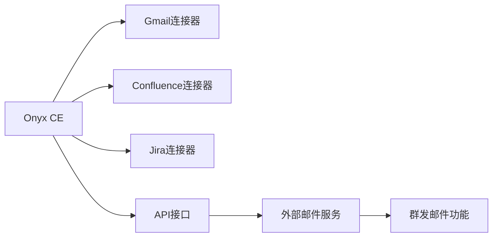

# Onyx 社区版（CE）与企业版（EE）功能对比分析

## 1. 版本概述

### 1.1 社区版（Community Edition - CE）
- **许可证**：MIT Expat License
- **费用**：完全免费
- **适用场景**：个人用户、小团队、开发测试环境
- **源码位置**：除 `ee/` 目录外的所有代码

### 1.2 企业版（Enterprise Edition - EE）
- **许可证**：DanswerAI Enterprise License
- **费用**：按用户席位收费的订阅模式
- **适用场景**：大型企业、需要高级功能的组织
- **源码位置**：`backend/ee/` 和 `web/src/app/ee/` 目录

## 2. 核心功能对比

### 2.1 连接器系统

#### 社区版（CE）支持的连接器
✅ **完全支持的连接器（40+种）**：
- **文档系统**：Google Drive、Confluence、SharePoint、Notion、Bookstack
- **通信工具**：Slack、Microsoft Teams、Gmail、Discord
- **开发工具**：GitHub、GitLab、Jira
- **CRM系统**：Salesforce、Zendesk、Freshdesk
- **云存储**：Dropbox、S3、Google Cloud Storage、OCI Storage
- **其他**：本地文件、网站、Wikipedia、Mediawiki等

#### 企业版（EE）额外功能
✅ **高级权限控制**：
- 从数据源继承的细粒度权限控制
- 外部用户组权限同步
- 高级访问控制列表（ACL）

### 2.2 您需要的具体功能分析

#### ✅ Gmail连接器（CE完全支持）
**社区版包含的Gmail功能**：
- 完整的Gmail连接器实现
- OAuth2认证支持
- 邮件内容索引和搜索
- 增量同步机制
- 支持个人Gmail和G Suite企业邮箱

**配置要求**：
- Google API凭据（OAuth2客户端ID和密钥）
- Gmail API访问权限
- 支持服务账户认证（适用于企业环境）

#### ✅ Confluence连接器（CE完全支持）
**社区版包含的Confluence功能**：
- 支持Confluence Cloud和Server/Data Center
- 页面和空间内容索引
- 附件处理
- 权限继承
- CQL查询支持
- 递归页面索引

#### ✅ Jira连接器（CE完全支持）
**社区版包含的Jira功能**：
- 问题（Issues）和评论索引
- 项目级别的访问控制
- 自定义字段支持
- 增量同步
- 评论邮箱黑名单功能

### 2.3 邮件发送功能分析

#### ❌ 群发邮件功能（不支持）
**当前邮件功能限制**：
- Onyx主要是**邮件内容索引和搜索**平台，不是邮件发送平台
- 现有邮件功能仅限于：
  - 用户验证邮件发送
  - 密码重置邮件发送
  - 系统通知邮件发送

**SMTP配置支持**：
```yaml
# 支持的SMTP配置（仅用于系统邮件）
SMTP_SERVER: "smtp.gmail.com"  # SMTP服务器
SMTP_PORT: "587"               # SMTP端口
SMTP_USER: "your-email@company.com"  # SMTP用户名
SMTP_PASS: "your-password"     # SMTP密码
EMAIL_FROM: "your-email@company.com"  # 发件人地址
```

## 3. 企业版独有功能

### 3.1 高级管理功能
- **用户管理**：高级用户角色和权限管理
- **查询历史**：详细的查询历史记录和分析
- **计费管理**：订阅和计费信息管理
- **白标定制**：自定义品牌和主题

### 3.2 高级安全功能
- **细粒度权限控制**：文档级别的访问控制
- **外部权限同步**：与企业目录服务集成
- **审计日志**：详细的用户操作审计

### 3.3 企业级集成
- **多租户支持**：SaaS模式的租户隔离
- **高级分析**：使用情况分析和报告
- **企业级支持**：专业技术支持服务

## 4. 针对您需求的建议

### 4.1 可以在社区版实现的功能
✅ **Gmail邮件获取**：
- 完全支持Gmail连接器
- 可以获取公司邮箱的邮件列表
- 支持邮件内容搜索和分析

✅ **Confluence和Jira集成**：
- 完全支持这两个连接器
- 可以索引和搜索Confluence页面和Jira问题

### 4.2 需要自定义开发的功能
❌ **邮件群发功能**：
- Onyx不是邮件营销平台，不提供群发邮件功能
- 如需此功能，建议：
  1. 集成专门的邮件服务（如SendGrid、Mailchimp）
  2. 开发自定义工具或插件
  3. 使用现有的邮件营销平台

### 4.3 实现方案建议

#### 方案一：使用社区版 + 外部邮件服务


#### 方案二：自定义开发邮件功能
- 基于Onyx的开放架构开发邮件发送插件
- 利用现有的SMTP配置扩展群发功能
- 集成到Onyx的工具系统中

## 5. 技术实现指导

### 5.1 Gmail连接器配置
```python
# Gmail连接器配置示例
{
    "source": "gmail",
    "connector_specific_config": {},
    "credential_json": {
        "google_tokens": {
            "access_token": "...",
            "refresh_token": "...",
            "token_uri": "https://oauth2.googleapis.com/token",
            "client_id": "...",
            "client_secret": "..."
        }
    }
}
```

### 5.2 自定义邮件发送工具开发
```python
# 可以基于Onyx的工具系统开发邮件发送功能
from onyx.tools.tool import Tool
from onyx.tools.models import ToolResponse

class EmailSenderTool(Tool):
    def __init__(self):
        self.name = "email_sender"
        self.description = "Send emails to specified recipients"
    
    def run(self, recipients: list[str], subject: str, content: str) -> ToolResponse:
        # 实现邮件发送逻辑
        pass
```

## 6. 总结和建议

### 6.1 社区版完全满足的需求
- ✅ Gmail邮件获取和索引
- ✅ Confluence内容集成
- ✅ Jira问题管理集成
- ✅ 基础的AI搜索和聊天功能

### 6.2 需要额外解决的需求
- ❌ 邮件群发功能（需要集成外部服务或自定义开发）

### 6.3 推荐实施路径
1. **第一阶段**：部署Onyx社区版，配置Gmail、Confluence、Jira连接器
2. **第二阶段**：评估邮件群发需求，选择合适的外部邮件服务
3. **第三阶段**：开发API集成，将邮件服务与Onyx连接

### 6.4 成本效益分析
- **社区版**：免费，满足大部分需求
- **企业版**：按席位收费，主要提供高级管理和安全功能
- **建议**：先使用社区版验证功能，根据实际需求决定是否升级

Onyx社区版已经能够满足您提到的大部分需求，只有邮件群发功能需要通过集成外部服务来实现。这是一个成本效益很高的解决方案。
