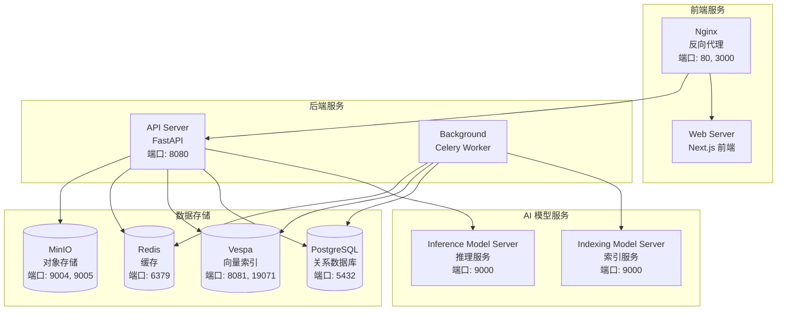

# Onyx Docker 本地部署完整路线图

## 📋 文档概述

本文档提供在本地 Docker Desktop 环境中部署 Onyx 项目的完整指南,包括所有必要的配置、步骤和注意事项。

---

## 1. 前置准备

### 1.1 系统要求

| 项目 | 要求 |
|------|------|
| **操作系统** | Windows 10/11 (已安装 Docker Desktop) |
| **Docker Desktop** | 最新版本 |
| **内存** | 最少 8GB RAM (推荐 16GB+) |
| **磁盘空间** | 最少 20GB 可用空间 |
| **CPU** | 4 核心以上 (推荐 8 核心+) |

### 1.2 必需软件

✅ **Docker Desktop for Windows**
- 下载地址: https://www.docker.com/products/docker-desktop
- 确保 WSL 2 已启用
- 确保 Docker Compose 已集成 (Docker Desktop 自带)

✅ **Git** (用于克隆代码)
- 下载地址: https://git-scm.com/download/win

---

## 2. 项目架构概览

### 2.1 Docker 服务组件

Onyx 使用 **Docker Compose** 部署,包含以下 9 个核心服务:



### 2.2 服务详细说明

| 服务名称 | 镜像 | 端口 | 职责 |
|---------|------|------|------|
| **nginx** | nginx:1.23.4-alpine | 80, 3000 | 反向代理,路由请求 |
| **web_server** | onyxdotapp/onyx-web-server | - | Next.js 前端应用 |
| **api_server** | onyxdotapp/onyx-backend | 8080 | FastAPI 后端 API |
| **background** | onyxdotapp/onyx-backend | - | Celery 后台任务 |
| **inference_model_server** | onyxdotapp/onyx-model-server | 9000 | AI 推理服务 |
| **indexing_model_server** | onyxdotapp/onyx-model-server | 9000 | 文档索引服务 |
| **relational_db** | postgres:15.2-alpine | 5432 | PostgreSQL 数据库 |
| **index** | vespaengine/vespa:8.526.15 | 8081, 19071 | Vespa 向量搜索 |
| **cache** | redis:7.4-alpine | 6379 | Redis 缓存 |
| **minio** | minio/minio:latest | 9004, 9005 | MinIO 对象存储 |

---

## 3. Dockerfile 分析

### 3.1 后端 Dockerfile (`backend/Dockerfile`)

**基础镜像**: `python:3.11.7-slim-bookworm`

**关键构建步骤**:
1. 安装系统依赖 (cmake, curl, zip, ca-certificates, etc.)
2. 安装 Python 依赖 (`requirements/default.txt` + `requirements/ee.txt`)
3. 安装 Playwright (用于网页抓取)
4. 预下载 NLP 模型 (nomic-embed-text-v1)
5. 预下载 NLTK 数据
6. 复制应用代码 (onyx, alembic, supervisord.conf, etc.)

**环境变量**:
- `ONYX_VERSION`: 版本号
- `DANSWER_RUNNING_IN_DOCKER`: "true"
- `PYTHONPATH`: /app

### 3.2 前端 Dockerfile (`web/Dockerfile`)

**基础镜像**: `node:20-alpine`

**多阶段构建**:
1. **Builder 阶段**:
   - 安装 npm 依赖 (`npm ci`)
   - 构建 Next.js 应用 (`npx next build`)
   - 支持多个构建时环境变量

2. **Runner 阶段**:
   - 复制构建产物 (`.next/standalone`, `.next/static`)
   - 创建非 root 用户 (nextjs:nodejs)
   - 运行 Next.js 服务器

**启动命令**: `node server.js`

### 3.3 模型服务 Dockerfile (`backend/Dockerfile.model_server`)

与后端 Dockerfile 类似,但专门用于 AI 模型推理服务。

---

## 4. 部署步骤详解

### 4.1 克隆项目

```powershell
# 克隆 Onyx 项目
cd f:\code
git clone https://github.com/onyx-dot-app/onyx.git
cd onyx
```

### 4.2 进入部署目录

```powershell
cd deployment\docker_compose
```

### 4.3 配置环境变量 (可选)

对于本地开发,默认配置已经足够。如果需要自定义配置:

1. 创建 `.env` 文件 (参考 `env.prod.template`)
2. 配置关键变量:

```bash
# 认证设置 (可选,默认禁用)
AUTH_TYPE=disabled

# LLM API 密钥 (必需,用于 AI 功能)
GEN_AI_API_KEY=your_openai_api_key_here

# PostgreSQL 配置 (默认值已足够)
POSTGRES_USER=postgres
POSTGRES_PASSWORD=password
POSTGRES_DB=onyx

# MinIO 配置 (默认值已足够)
MINIO_ROOT_USER=minioadmin
MINIO_ROOT_PASSWORD=minioadmin
```

### 4.4 启动服务

#### 方式一: 使用预构建镜像 (推荐,更快)

```powershell
docker compose -f docker-compose.dev.yml -p onyx-stack up -d --pull always --force-recreate
```

**说明**:
- `-f docker-compose.dev.yml`: 使用开发环境配置
- `-p onyx-stack`: 项目名称为 onyx-stack
- `up -d`: 后台启动
- `--pull always`: 总是拉取最新镜像
- `--force-recreate`: 强制重新创建容器

#### 方式二: 从源码构建 (较慢,约 15-30 分钟)

```powershell
docker compose -f docker-compose.dev.yml -p onyx-stack up -d --build --force-recreate
```

**说明**:
- `--build`: 从源码构建镜像

### 4.5 等待服务启动

首次启动需要:
- 下载镜像: 5-15 分钟 (取决于网速)
- 初始化数据库: 1-2 分钟
- 下载 AI 模型: 2-5 分钟

**查看启动进度**:

```powershell
# 查看所有容器状态
docker compose -f docker-compose.dev.yml -p onyx-stack ps

# 查看 API 服务日志
docker compose -f docker-compose.dev.yml -p onyx-stack logs -f api_server

# 查看所有服务日志
docker compose -f docker-compose.dev.yml -p onyx-stack logs -f
```

### 4.6 验证部署

**检查服务健康状态**:

```powershell
# 检查所有容器是否运行
docker ps --filter "name=onyx-stack"
```

**访问服务**:

| 服务 | URL | 说明 |
|------|-----|------|
| **Web 前端** | http://localhost:3000 | 主界面 |
| **API 文档** | http://localhost:8080/docs | FastAPI Swagger UI |
| **PostgreSQL** | localhost:5432 | 数据库 (用户: postgres, 密码: password) |
| **Redis** | localhost:6379 | 缓存 |
| **MinIO Console** | http://localhost:9005 | 对象存储管理界面 |
| **Vespa** | http://localhost:8081 | 向量搜索引擎 |

---

## 5. 常见操作

### 5.1 停止服务

```powershell
# 停止所有容器 (保留数据)
docker compose -f docker-compose.dev.yml -p onyx-stack stop

# 停止并删除容器 (保留数据卷)
docker compose -f docker-compose.dev.yml -p onyx-stack down
```

### 5.2 完全清理 (⚠️ 会删除所有数据)

```powershell
# 删除容器和数据卷
docker compose -f docker-compose.dev.yml -p onyx-stack down -v
```

### 5.3 重启服务

```powershell
# 重启所有服务
docker compose -f docker-compose.dev.yml -p onyx-stack restart

# 重启单个服务
docker compose -f docker-compose.dev.yml -p onyx-stack restart api_server
```

### 5.4 查看日志

```powershell
# 查看所有服务日志
docker compose -f docker-compose.dev.yml -p onyx-stack logs -f

# 查看特定服务日志
docker compose -f docker-compose.dev.yml -p onyx-stack logs -f api_server

# 查看最近 100 行日志
docker compose -f docker-compose.dev.yml -p onyx-stack logs --tail=100
```

### 5.5 进入容器调试

```powershell
# 进入 API 服务器容器
docker exec -it onyx-stack-api_server-1 /bin/bash

# 进入 PostgreSQL 容器
docker exec -it onyx-stack-relational_db-1 psql -U postgres -d onyx
```

---

## 6. 数据持久化

### 6.1 Docker 数据卷

Onyx 使用以下数据卷持久化数据:

| 数据卷名称 | 用途 | 重要性 |
|-----------|------|--------|
| `db_volume` | PostgreSQL 数据 | ⭐⭐⭐⭐⭐ |
| `vespa_volume` | Vespa 索引数据 | ⭐⭐⭐⭐⭐ |
| `minio_data` | MinIO 对象存储 | ⭐⭐⭐⭐ |
| `model_cache_huggingface` | AI 模型缓存 | ⭐⭐⭐ |
| `indexing_huggingface_model_cache` | 索引模型缓存 | ⭐⭐⭐ |
| `api_server_logs` | API 日志 | ⭐⭐ |
| `background_logs` | 后台任务日志 | ⭐⭐ |

### 6.2 备份数据

```powershell
# 备份 PostgreSQL 数据库
docker exec onyx-stack-relational_db-1 pg_dump -U postgres onyx > onyx_backup.sql

# 备份所有数据卷
docker run --rm -v onyx-stack_db_volume:/data -v ${PWD}:/backup alpine tar czf /backup/db_backup.tar.gz /data
```

### 6.3 恢复数据

```powershell
# 恢复 PostgreSQL 数据库
docker exec -i onyx-stack-relational_db-1 psql -U postgres onyx < onyx_backup.sql
```

---

## 7. 配置 LLM (必需)

Onyx 需要配置 LLM API 才能使用 AI 功能。

### 7.1 配置 OpenAI

1. 获取 OpenAI API Key: https://platform.openai.com/api-keys

2. 创建 `.env` 文件:

```bash
GEN_AI_API_KEY=sk-your-openai-api-key-here
```

3. 重启服务:

```powershell
docker compose -f docker-compose.dev.yml -p onyx-stack down
docker compose -f docker-compose.dev.yml -p onyx-stack up -d
```

### 7.2 配置其他 LLM

Onyx 支持多种 LLM:
- Anthropic Claude
- Google Gemini
- Cohere
- 本地模型 (通过 LiteLLM)

在 Web 界面的 **Admin > Settings > LLM** 中配置。

---

## 8. 故障排查

### 8.1 常见问题

#### 问题 1: 容器启动失败

**症状**: 容器反复重启

**解决方案**:
```powershell
# 查看容器日志
docker compose -f docker-compose.dev.yml -p onyx-stack logs api_server

# 检查端口占用
netstat -ano | findstr "8080"
netstat -ano | findstr "5432"
```

#### 问题 2: 无法访问 Web 界面

**症状**: http://localhost:3000 无法打开

**解决方案**:
```powershell
# 检查 nginx 和 web_server 是否运行
docker ps --filter "name=nginx"
docker ps --filter "name=web_server"

# 查看 nginx 日志
docker compose -f docker-compose.dev.yml -p onyx-stack logs nginx
```

#### 问题 3: 数据库连接失败

**症状**: API 日志显示数据库连接错误

**解决方案**:
```powershell
# 检查 PostgreSQL 是否运行
docker ps --filter "name=relational_db"

# 测试数据库连接
docker exec -it onyx-stack-relational_db-1 psql -U postgres -d onyx -c "SELECT 1;"
```

#### 问题 4: AI 模型下载失败

**症状**: 模型服务启动缓慢或失败

**解决方案**:
- 检查网络连接
- 使用代理 (如果在国内)
- 手动下载模型并挂载到容器

### 8.2 性能优化

#### 调整 Docker Desktop 资源

1. 打开 Docker Desktop
2. Settings > Resources
3. 建议配置:
   - **CPUs**: 6-8 核心
   - **Memory**: 12-16 GB
   - **Swap**: 2 GB
   - **Disk image size**: 100 GB

#### 调整服务并发

编辑 `docker-compose.dev.yml`,修改环境变量:

```yaml
environment:
  - POSTGRES_API_SERVER_POOL_SIZE=20  # 数据库连接池大小
  - CELERY_WORKER_DOCPROCESSING_CONCURRENCY=4  # Celery 并发数
```

---

## 9. 生产环境部署

### 9.1 切换到生产配置

```powershell
# 使用生产环境配置
docker compose -f docker-compose.prod.yml -p onyx-stack up -d
```

### 9.2 启用 HTTPS

1. 配置 `.env.nginx`:

```bash
DOMAIN=your-domain.com
CERTBOT_EMAIL=your-email@example.com
```

2. 运行 Let's Encrypt 脚本:

```powershell
chmod +x init-letsencrypt.sh
./init-letsencrypt.sh
```

### 9.3 启用用户认证

在 `.env` 中配置:

```bash
AUTH_TYPE=google_oauth
GOOGLE_OAUTH_CLIENT_ID=your-client-id
GOOGLE_OAUTH_CLIENT_SECRET=your-client-secret
```

---

## 10. GPU 支持 (可选)

如果您有 NVIDIA GPU,可以启用 GPU 加速:

### 10.1 前置要求

1. 安装 NVIDIA 驱动
2. 安装 `nvidia-container-toolkit`

### 10.2 启动 GPU 版本

```powershell
docker compose -f docker-compose.gpu-dev.yml -p onyx-stack up -d --pull always --force-recreate
```

---

## 11. 快速参考

### 11.1 常用命令速查

| 操作 | 命令 |
|------|------|
| 启动服务 | `docker compose -f docker-compose.dev.yml -p onyx-stack up -d` |
| 停止服务 | `docker compose -f docker-compose.dev.yml -p onyx-stack stop` |
| 重启服务 | `docker compose -f docker-compose.dev.yml -p onyx-stack restart` |
| 查看日志 | `docker compose -f docker-compose.dev.yml -p onyx-stack logs -f` |
| 查看状态 | `docker compose -f docker-compose.dev.yml -p onyx-stack ps` |
| 完全清理 | `docker compose -f docker-compose.dev.yml -p onyx-stack down -v` |

### 11.2 重要端口

| 端口 | 服务 |
|------|------|
| 3000 | Web 前端 |
| 8080 | API 服务 |
| 5432 | PostgreSQL |
| 6379 | Redis |
| 8081 | Vespa |
| 9004 | MinIO API |
| 9005 | MinIO Console |

---

## 12. 下一步

部署成功后,您可以:

1. ✅ 访问 http://localhost:3000 开始使用
2. ✅ 在 **Admin > Connectors** 中配置数据源连接器
3. ✅ 在 **Admin > Personas** 中创建自定义 AI 助手
4. ✅ 在 **Chat** 界面开始对话

---

## 13. 获取帮助

- 📖 官方文档: https://docs.onyx.app
- 💬 Slack 社区: https://join.slack.com/t/onyx-dot-app/shared_invite/...
- 🐛 GitHub Issues: https://github.com/onyx-dot-app/onyx/issues
- 📧 邮件支持: founders@onyx.app

---

**文档版本**: v1.0  
**最后更新**: 2025-01-24  
**适用于**: Onyx 本地 Docker Desktop 部署
