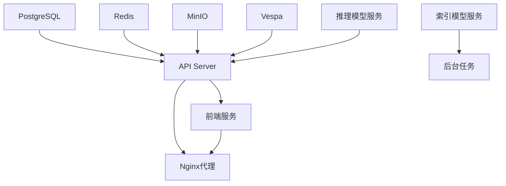

# Onyx 中间件和服务完整清单

## 🐳 Docker容器服务清单

### 📊 完整服务列表

| 序号 | 服务名称 | 镜像版本 | 内部端口 | 外部端口 | 功能描述 | 状态 |
|------|----------|----------|----------|----------|----------|------|
| 1 | **relational_db** | `postgres:15.2-alpine` | 5432 | 5432 | PostgreSQL主数据库 | 🔥 关键 |
| 2 | **cache** | `redis:7.4-alpine` | 6379 | 6379 | Redis缓存服务 | 🔥 关键 |
| 3 | **minio** | `minio/minio:latest` | 9000,9001 | 9004,9005 | S3兼容文件存储 | 🔥 关键 |
| 4 | **index** | `vespaengine/vespa:8.526.15` | 19071,8081 | 19071,8081 | Vespa搜索引擎 | 🔥 关键 |
| 5 | **inference_model_server** | `onyxdotapp/onyx-model-server:latest` | 9000 | 9000 | AI推理模型服务 | 🔥 关键 |
| 6 | **indexing_model_server** | `onyxdotapp/onyx-model-server:latest` | 9000 | 9001 | AI索引模型服务 | 🔥 关键 |
| 7 | **api_server** | `onyxdotapp/onyx-backend:latest` | 8080 | 8080 | FastAPI后端服务 | 🔥 关键 |
| 8 | **background** | `onyxdotapp/onyx-backend:latest` | - | - | Celery后台任务 | 🔥 关键 |
| 9 | **web_server** | `onyxdotapp/onyx-web-server:latest` | 3000 | 3000 | Next.js前端服务 | 🔥 关键 |
| 10 | **nginx** | `nginx:1.23.4-alpine` | 80 | 80 | 反向代理服务 | ⚠️ 可选 |

## 🔧 详细服务配置

### 1. PostgreSQL数据库 (relational_db)
```yaml
镜像: postgres:15.2-alpine
端口: 5432:5432
环境变量:
  - POSTGRES_DB: onyx
  - POSTGRES_USER: postgres
  - POSTGRES_PASSWORD: ${POSTGRES_PASSWORD}
  - POSTGRES_INITDB_ARGS: --auth-host=scram-sha-256
配置:
  - max_connections: 250
  - shared_buffers: 256MB
  - effective_cache_size: 1GB
存储卷: db_volume:/var/lib/postgresql/data
健康检查: pg_isready -U postgres
```

### 2. Redis缓存 (cache)
```yaml
镜像: redis:7.4-alpine
端口: 6379:6379
配置:
  - 内存策略: allkeys-lru
  - 最大内存: 256MB
  - 持久化: 禁用 (临时缓存)
健康检查: redis-cli ping
```

### 3. MinIO文件存储 (minio)
```yaml
镜像: minio/minio:latest
端口: 
  - 9004:9000 (API)
  - 9005:9001 (控制台)
环境变量:
  - MINIO_ROOT_USER: minioadmin
  - MINIO_ROOT_PASSWORD: minioadmin
存储卷: minio_data:/data
健康检查: /minio/health/live
```

### 4. Vespa搜索引擎 (index)
```yaml
镜像: vespaengine/vespa:8.526.15
端口:
  - 19071:19071 (应用端口)
  - 8081:8081 (管理端口)
配置:
  - 内存分配: 2GB
  - 索引类型: 向量+全文搜索
存储卷: vespa_volume:/opt/vespa/var
健康检查: /ApplicationStatus
```

### 5. AI推理模型服务器 (inference_model_server)
```yaml
镜像: onyxdotapp/onyx-model-server:latest
端口: 9000:9000
功能:
  - 文档嵌入生成
  - 查询重排序
  - 向量相似度计算
模型缓存: model_cache_huggingface:/root/.cache/huggingface
健康检查: /health
```

### 6. AI索引模型服务器 (indexing_model_server)
```yaml
镜像: onyxdotapp/onyx-model-server:latest
端口: 9001:9000
功能:
  - 文档索引时的嵌入
  - 批量文档处理
  - 索引优化
模型缓存: indexing_huggingface_model_cache:/root/.cache/huggingface
健康检查: /health
```

### 7. FastAPI后端服务器 (api_server)
```yaml
镜像: onyxdotapp/onyx-backend:latest
端口: 8080:8080
功能:
  - REST API服务
  - 用户认证
  - 聊天会话管理
  - 连接器管理
依赖: relational_db, cache, index, inference_model_server
健康检查: /health
```

### 8. Celery后台任务 (background)
```yaml
镜像: onyxdotapp/onyx-backend:latest
端口: 无外部端口
功能:
  - 文档索引任务
  - 连接器同步
  - 邮件发送
  - 定时任务
依赖: relational_db, cache, index, indexing_model_server
```

### 9. Next.js前端服务器 (web_server)
```yaml
镜像: onyxdotapp/onyx-web-server:latest
端口: 3000:3000
功能:
  - React用户界面
  - 聊天界面
  - 管理界面
  - 静态资源服务
依赖: api_server
健康检查: HTTP GET /
```

### 10. Nginx反向代理 (nginx)
```yaml
镜像: nginx:1.23.4-alpine
端口: 80:80
功能:
  - 反向代理
  - 负载均衡
  - 静态文件服务
  - SSL终止
配置: 自定义nginx.conf
依赖: api_server, web_server
```

## 🌐 网络端口分配

### 对外服务端口
- **80** - Nginx HTTP入口 (主要访问点)
- **3000** - 前端Web服务 (直接访问)
- **8080** - 后端API服务 (直接访问)

### 管理和监控端口
- **8081** - Vespa管理界面
- **9005** - MinIO管理控制台

### 内部服务端口
- **5432** - PostgreSQL数据库
- **6379** - Redis缓存
- **9000** - AI推理模型服务
- **9001** - AI索引模型服务
- **9004** - MinIO API
- **19071** - Vespa应用端口

## 💾 存储卷配置

### 持久化数据卷
```yaml
db_volume:
  用途: PostgreSQL数据持久化
  大小: ~5GB
  备份: 重要

vespa_volume:
  用途: Vespa搜索索引
  大小: ~10GB
  备份: 重要

minio_data:
  用途: 文件存储
  大小: ~20GB
  备份: 重要
```

### 缓存数据卷
```yaml
model_cache_huggingface:
  用途: AI模型缓存
  大小: ~8GB
  备份: 可选

indexing_huggingface_model_cache:
  用途: 索引模型缓存
  大小: ~8GB
  备份: 可选
```

### 日志数据卷
```yaml
api_server_logs:
  用途: API服务器日志
  大小: ~1GB
  轮转: 每日

background_logs:
  用途: 后台任务日志
  大小: ~1GB
  轮转: 每日

inference_model_server_logs:
  用途: 推理服务日志
  大小: ~500MB
  轮转: 每日

indexing_model_server_logs:
  用途: 索引服务日志
  大小: ~500MB
  轮转: 每日
```

## 🔗 服务依赖关系

### 启动顺序


### 依赖矩阵
| 服务 | PostgreSQL | Redis | MinIO | Vespa | 推理模型 | 索引模型 | API服务器 | 后台任务 | 前端 | Nginx |
|------|------------|-------|-------|-------|----------|----------|-----------|----------|------|-------|
| API服务器 | ✅ | ✅ | ✅ | ✅ | ✅ | - | - | - | - | - |
| 后台任务 | ✅ | ✅ | ✅ | ✅ | - | ✅ | - | - | - | - |
| 前端服务 | - | - | - | - | - | - | ✅ | - | - | - |
| Nginx代理 | - | - | - | - | - | - | ✅ | - | ✅ | - |

## 📊 资源需求详细分析

### 内存分配 (总计 ~14GB)
```
PostgreSQL:        512MB
Redis:              256MB
MinIO:              256MB
Vespa:              2GB
推理模型服务器:      4GB
索引模型服务器:      4GB
API服务器:          1GB
后台任务:           1GB
前端服务:           512MB
Nginx:              64MB
系统开销:           512MB
```

### CPU需求
```
轻负载 (开发):      4核心
中等负载 (测试):    8核心
重负载 (生产):      16核心
```

### 磁盘使用 (总计 ~65GB)
```
Docker镜像:         ~10GB
PostgreSQL数据:     ~5GB
Vespa索引:          ~10GB
MinIO文件:          ~20GB
模型缓存:           ~15GB
日志文件:           ~5GB
```

## ⚙️ 环境变量配置

### 必需环境变量
```bash
# 数据库配置
POSTGRES_USER=postgres
POSTGRES_PASSWORD=your_secure_password
POSTGRES_DB=onyx

# AI服务配置
GEN_AI_API_KEY=your_openai_api_key
GEN_AI_MODEL_PROVIDER=openai
GEN_AI_MODEL_VERSION=gpt-4o

# 文件存储配置
MINIO_ROOT_USER=minioadmin
MINIO_ROOT_PASSWORD=minioadmin

# 应用配置
SECRET_KEY=your_secret_key
WEB_DOMAIN=http://localhost
```

### 可选环境变量
```bash
# 监控配置
SENTRY_DSN=your_sentry_dsn
PROMETHEUS_ENABLED=true

# 邮件配置
SENDGRID_API_KEY=your_sendgrid_key
SMTP_SERVER=smtp.gmail.com

# 认证配置
OAUTH_CLIENT_ID=your_oauth_client_id
OAUTH_CLIENT_SECRET=your_oauth_secret
```

## 🔍 健康检查端点

### 服务健康检查URL
```bash
# 核心服务
http://localhost:8080/health          # API服务器
http://localhost:3000                 # 前端服务
http://localhost                      # Nginx代理

# 中间件服务
http://localhost:9004/minio/health/live    # MinIO
http://localhost:19071/ApplicationStatus   # Vespa
http://localhost:9000/health               # 推理模型
http://localhost:9001/health               # 索引模型

# 数据库服务 (需要客户端)
pg_isready -h localhost -p 5432 -U postgres  # PostgreSQL
redis-cli -h localhost -p 6379 ping          # Redis
```

## 🛠️ 管理界面访问

### Web管理界面
- **Onyx主界面**: http://localhost
- **API文档**: http://localhost/api/docs
- **MinIO控制台**: http://localhost:9005
- **Vespa控制台**: http://localhost:8081

### 管理员账户
```bash
# MinIO默认账户
用户名: minioadmin
密码: minioadmin

# PostgreSQL默认账户
用户名: postgres
密码: ${POSTGRES_PASSWORD}
```

---

**📋 总结**: Onyx系统包含10个Docker容器，使用12个网络端口，需要9个存储卷，总资源需求约14GB内存和65GB磁盘空间。
