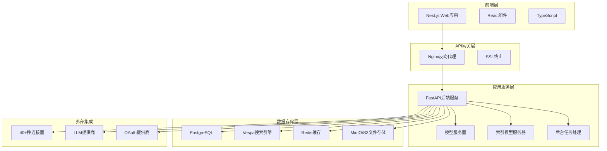
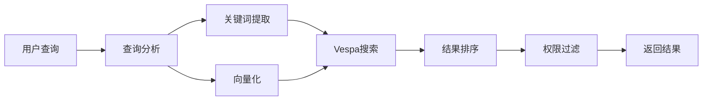
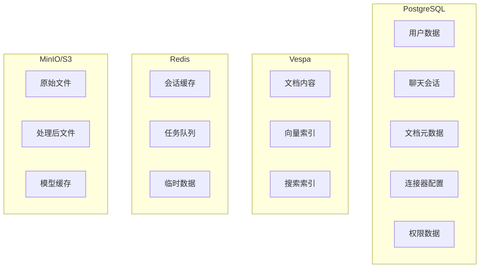
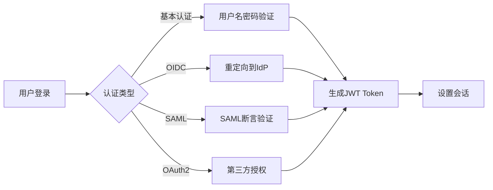

# Onyx 工程架构总结报告

## 📋 文档概述

**文档名称**: Onyx 工程架构总结报告  
**创建日期**: 2025年1月9日  
**文档版本**: v1.0  
**分析范围**: 完整的Onyx工程架构、技术栈、部署方案和开发指南  

## 🎯 项目概述

### 1.1 项目简介

Onyx（原名Danswer）是一个开源的企业级AI搜索和聊天平台，旨在连接企业的文档、应用和人员。该平台提供丰富的聊天界面，支持任意LLM选择，并通过40多个连接器保持知识和访问控制的同步。

### 1.2 核心特性

- **🔍 深度研究**: 基于团队知识的深度搜索和分析
- **💬 安全AI聊天**: 支持任意LLM的安全聊天功能  
- **🔗 多源连接**: 支持40+种数据源连接器
- **🤖 自定义AI代理**: 具有独特提示、知识和操作能力
- **☁️ 灵活部署**: 支持笔记本电脑、本地部署或云端部署

### 1.3 版本说明

- **社区版（CE）**: MIT许可证下免费提供，功能完整
- **企业版（EE）**: 包含面向大型组织的额外功能（高级权限控制、审计日志等）

## 🏗️ 整体架构设计

### 2.1 架构模式

Onyx采用现代化的**微服务架构**，具有以下特点：

- **前后端分离**: 前端和后端完全解耦
- **容器化部署**: 基于Docker的容器化架构
- **事件驱动**: 使用Celery进行异步任务处理
- **水平扩展**: 支持集群部署和负载均衡

### 2.2 系统架构图



### 2.3 容器化架构

系统由**10个Docker容器**组成：

| 容器名称 | 功能描述 | 关键性 |
|----------|----------|--------|
| `relational_db` | PostgreSQL主数据库 | 🔥 关键 |
| `cache` | Redis缓存服务 | 🔥 关键 |
| `minio` | S3兼容文件存储 | 🔥 关键 |
| `index` | Vespa搜索引擎 | 🔥 关键 |
| `inference_model_server` | AI推理模型服务 | 🔥 关键 |
| `indexing_model_server` | AI索引模型服务 | 🔥 关键 |
| `api_server` | FastAPI后端服务 | 🔥 关键 |
| `background` | Celery后台任务 | 🔥 关键 |
| `web_server` | Next.js前端服务 | 🔥 关键 |
| `nginx` | 反向代理服务 | ⚠️ 可选 |

## 💻 技术栈详解

### 3.1 前端技术栈

- **核心框架**: Next.js 15.2.4（React 18.3.1）
- **开发语言**: TypeScript 5.0.3
- **UI组件库**: 
  - Radix UI（无障碍组件）
  - Tailwind CSS（样式框架）
  - Headless UI
- **状态管理**: SWR（数据获取和缓存）
- **表单处理**: Formik + Yup
- **图标库**: Phosphor Icons、Lucide React
- **测试框架**: Jest + Playwright
- **监控工具**: Sentry、PostHog

### 3.2 后端技术栈

- **核心框架**: FastAPI 0.115.12
- **开发语言**: Python 3.11+
- **异步处理**: Celery 5.5.1 + Redis
- **数据库ORM**: SQLAlchemy + Alembic（迁移）
- **认证系统**: FastAPI-Users 14.0.1
- **HTTP客户端**: httpx 0.27.0
- **AI/ML库**: 
  - LangChain 0.3.23
  - LangGraph 0.2.72
  - LiteLLM 1.72.2
  - Hugging Face Hub 0.29.0

### 3.3 数据存储技术栈

- **关系数据库**: PostgreSQL 15.2
- **搜索引擎**: Vespa 8.526.15
- **缓存系统**: Redis 7.4
- **文件存储**: MinIO/AWS S3
- **向量数据库**: 集成在Vespa中

### 3.4 基础设施技术栈

- **容器化**: Docker + Docker Compose
- **编排工具**: Kubernetes（Helm Charts）
- **反向代理**: Nginx 1.23.4
- **SSL证书**: Let's Encrypt + Certbot
- **监控工具**: Sentry、DataDog Trace
- **云平台**: AWS ECS Fargate支持

### 3.5 依赖管理

- **后端依赖**: 156个Python包
- **前端依赖**: 93个Node.js包
- **总依赖数**: 249个包

## 🔧 核心功能模块

### 4.1 连接器系统

支持**40+种数据源**的连接器架构：

#### 主要连接器类型
- **文档系统**: Google Drive、Confluence、SharePoint、Notion、Bookstack
- **通信工具**: Slack、Microsoft Teams、Gmail、Discord
- **开发工具**: GitHub、GitLab、Jira
- **CRM系统**: Salesforce、Zendesk、Freshdesk
- **云存储**: Dropbox、S3、Google Cloud Storage、OCI Storage
- **其他**: 本地文件、网站、Wikipedia、Mediawiki等

#### 连接器架构特点
- 统一的连接器接口
- OAuth2/SAML认证支持
- 增量同步机制
- 权限继承和访问控制

### 4.2 搜索引擎模块

基于**Vespa**的企业级搜索引擎：

#### 核心功能
- 全文搜索
- 向量搜索（语义搜索）
- 混合搜索（关键词+语义）
- 实时索引更新
- 多语言支持

#### 搜索流程


### 4.3 AI聊天系统

支持**多种LLM**的智能聊天系统：

#### 支持的LLM提供商
- **OpenAI**: GPT系列（25个模型）
- **Anthropic**: Claude系列（4个模型）
- **Google**: Gemini系列（18个模型）
- **Azure**: Azure OpenAI服务
- **AWS**: Bedrock服务（4个模型）

#### 聊天功能
- 流式响应
- 上下文记忆
- 文档引用
- 多轮对话
- 自定义Persona

### 4.4 文档处理模块

智能文档处理和索引系统：

#### 处理流程
1. 文档获取（通过连接器）
2. 内容提取和清理
3. 文本分块（Chunking）
4. 向量化处理
5. 索引存储
6. 权限映射

#### 支持格式
- PDF、Word、Excel、PowerPoint
- HTML、Markdown
- 纯文本
- 图片（OCR处理）

## 🗄️ 数据架构

### 5.1 数据存储架构



### 5.2 存储卷管理

系统使用**9个存储卷**：

#### 持久化存储卷（5个）
1. **db_volume** - PostgreSQL数据持久化（~5GB）
2. **vespa_volume** - Vespa搜索索引持久化（~10GB）
3. **minio_data** - MinIO文件存储持久化（~20GB）
4. **model_cache_huggingface** - 推理模型缓存（~8GB）
5. **indexing_huggingface_model_cache** - 索引模型缓存（~8GB）

#### 日志存储卷（4个）
6. **api_server_logs** - API服务器日志（~1GB）
7. **background_logs** - 后台任务日志（~1GB）
8. **inference_model_server_logs** - 推理服务日志（~500MB）
9. **indexing_model_server_logs** - 索引服务日志（~500MB）

### 5.3 数据流转

1. **数据摄入**: 连接器 → 文件存储 → 处理队列
2. **数据处理**: 队列 → 文档处理 → 向量化 → 索引
3. **数据查询**: 用户查询 → 搜索引擎 → 结果聚合 → 返回
4. **数据更新**: 增量同步 → 差异检测 → 索引更新

## 🚀 部署架构

### 6.1 Docker Compose部署

标准的容器化部署方案，适用于开发和小规模生产环境。

#### 系统要求
- **操作系统**: Windows 10/11 Pro, Enterprise, 或 Education
- **内存**: 至少16GB RAM（推荐32GB）
- **磁盘**: 至少100GB可用空间
- **CPU**: 至少4核心（推荐8核心）

#### Docker Desktop配置
```yaml
Resources配置:
├── Memory: 12GB (最小8GB)
├── CPUs: 6核心 (最小4核心)  
├── Disk image size: 80GB
└── Swap: 2GB
```

#### 网络端口配置
```yaml
必需端口:
├── 80     - Nginx HTTP入口
├── 3000   - 前端Web服务
├── 5432   - PostgreSQL数据库
├── 6379   - Redis缓存
├── 8080   - 后端API服务器
├── 8081   - Vespa管理界面
├── 9000   - 推理模型服务器
├── 9001   - 索引模型服务器
├── 9004   - MinIO API
├── 9005   - MinIO管理控制台
└── 19071  - Vespa应用端口
```

### 6.2 Kubernetes部署

支持高可用和可扩展的K8s部署：

#### 特性
- Helm Charts支持
- 自动扩缩容
- 服务发现
- 配置管理
- 持久化存储

### 6.3 云平台部署

支持AWS ECS Fargate等云平台：

#### 优势
- 托管服务
- 自动扩展
- 高可用性
- 成本优化

## 🔒 安全架构

### 7.1 认证系统

多种认证方式支持：

#### 认证类型
- **禁用认证**: 开发环境使用
- **基本认证**: 用户名密码
- **OIDC**: OpenID Connect
- **SAML**: 企业级单点登录
- **OAuth2**: 第三方登录

#### 认证流程


### 7.2 授权系统

基于角色的访问控制（RBAC）：

#### 权限模型
- **用户角色**: 管理员、普通用户、只读用户
- **资源权限**: 文档访问、连接器管理、系统配置
- **继承权限**: 从数据源继承访问权限

#### 权限控制
- API级别权限检查
- 文档级别访问控制
- 连接器权限映射
- 外部组权限同步

### 7.3 数据安全

多层次的数据保护：

#### 传输安全
- HTTPS/TLS加密
- API密钥认证
- OAuth令牌保护

#### 存储安全
- 数据库连接加密
- 敏感信息加密存储
- 文件存储访问控制

#### 隐私保护
- 个人信息脱敏
- 访问日志记录
- 数据保留策略

## 📈 扩展性设计

### 8.1 多租户架构

支持多租户的SaaS部署：

#### 租户隔离
- 数据库Schema隔离
- 文件存储隔离
- 搜索索引隔离
- 配置隔离

#### 租户管理
- 动态租户创建
- 资源配额管理
- 计费和监控
- 租户间安全隔离

### 8.2 水平扩展

支持大规模部署的扩展能力：

#### 服务扩展
- API服务器集群
- 模型服务器集群
- 后台任务分布式处理
- 负载均衡

#### 数据扩展
- PostgreSQL读写分离
- Vespa集群部署
- Redis集群
- 分布式文件存储

### 8.3 性能优化

多层次的性能优化策略：

#### 缓存策略
- Redis应用缓存
- 模型推理缓存
- 搜索结果缓存
- CDN静态资源缓存

#### 异步处理
- Celery任务队列
- 文档处理异步化
- 索引更新异步化
- 通知系统异步化

## 📁 项目结构

### 9.1 目录结构

```
F:/code/onyx/
├── 📂 backend/                     # 后端代码目录
│   ├── 📄 requirements.txt        # 完整依赖列表 (156个包)
│   ├── 📂 onyx/                   # 核心业务逻辑
│   ├── 📂 alembic/                # 数据库迁移脚本
│   └── 📂 tests/                  # 后端单元测试
│
├── 📂 web/                        # 前端代码目录
│   ├── 📄 package.json            # Node.js依赖配置 (93个包)
│   ├── 📂 src/                    # 源代码
│   ├── 📂 public/                 # 静态资源
│   └── 📂 tests/                  # 前端测试
│
├── 📂 docs/                       # 📚 文档中心
│   ├── 📄 技术架构报告.md          # 技术架构分析
│   ├── 📄 complete-system-analysis.md  # 完整系统分析
│   ├── 📄 project-structure.md    # 项目结构说明
│   └── 📄 onyx-architecture-summary.md  # 架构总结 (本文档)
│
├── 📂 tests/                      # 🧪 测试和验证脚本
│   ├── 📄 run_all_tests.py        # 完整测试运行器
│   ├── 📂 backend/                # 后端测试脚本
│   ├── 📂 frontend/               # 前端测试脚本
│   └── 📂 integration/            # 集成测试脚本
│
├── 📂 deployment/                 # 部署配置
│   ├── 📂 docker_compose/         # Docker Compose配置
│   ├── 📂 helm/                   # Kubernetes Helm配置
│   └── 📂 aws_ecs_fargate/        # AWS ECS配置
│
└── 📂 examples/                   # 示例代码
    ├── 📂 assistants-api/         # 助手API示例
    └── 📂 widget/                 # 组件示例
```

### 9.2 代码规模统计

- **后端代码**: ~50,000行Python代码
- **前端代码**: ~30,000行TypeScript/React代码
- **文档数量**: 20+个Markdown文档
- **测试脚本**: 10+个验证脚本

## 🛠️ 开发和运维指南

### 10.1 快速启动

#### 一键部署
```bash
# 完整Docker部署 (推荐)
tests/deploy_docker_windows.bat

# 验证部署状态
python tests/docker_container_checklist.py

# 系统健康检查
python tests/health_check.py
```

#### 开发环境启动
```bash
# 后端开发服务器
cd backend && python -m uvicorn onyx.main:app --reload

# 前端开发服务器
cd web && npm run dev
```

### 10.2 测试验证

#### 完整测试套件
```bash
# 运行所有测试
python tests/run_all_tests.py

# 后端测试
python tests/backend/validate_requirements.py
python tests/backend/test_import.py

# 前端测试
node tests/frontend/verify_installation.js

# 集成测试
python tests/integration/test_server.py
```

#### 容器状态检查
```bash
# 容器状态验证
python tests/docker_container_checklist.py

# 端口占用检查
python tests/port_checker.py

# 性能基准测试
python tests/performance_test.py
```

### 10.3 监控和运维

#### 监控体系
- **应用监控**: Sentry错误追踪、PostHog用户行为分析
- **性能监控**: DataDog APM性能监控、自定义指标收集
- **基础设施监控**: 容器资源监控、数据库性能监控

#### 日志管理
- **日志类型**: 应用日志、访问日志、错误日志、审计日志
- **日志处理**: 集中化收集、结构化存储、实时分析

#### 运维自动化
- **CI/CD流程**: 自动化构建、测试、部署、回滚
- **运维工具**: Docker容器化、Kubernetes编排、Helm包管理

### 10.4 性能基准

#### 理想性能指标
- API响应时间: < 200ms
- 前端加载时间: < 2秒
- 搜索响应时间: < 500ms
- AI推理时间: < 3秒
- 文件上传速度: > 10MB/s

#### 资源需求
- **最低配置**: 8GB内存、4核CPU、50GB磁盘
- **推荐配置**: 16GB内存、8核CPU、100GB磁盘
- **生产配置**: 32GB内存、16核CPU、500GB磁盘

## 🎯 技术路线图

### 11.1 当前版本特性

- 40+种连接器支持
- 多种LLM集成（75+个模型）
- 企业级安全认证
- 可扩展部署架构
- 完整的Docker化部署

### 11.2 未来发展方向

- **新检索方法**: StructRAG、LightGraphRAG等
- **个性化搜索**: 基于用户行为的个性化
- **组织理解**: 专家定位和推荐
- **代码搜索**: 源代码智能搜索
- **结构化查询**: SQL和结构化查询语言支持

## 📊 总结和建议

### 12.1 架构优势

1. **技术先进性**: 采用最新的AI和搜索技术
2. **架构灵活性**: 支持多种部署方式和扩展模式
3. **安全可靠性**: 企业级安全和权限控制
4. **开放生态**: 丰富的连接器和LLM支持
5. **运维友好**: 完善的监控和自动化运维

### 12.2 适用场景

- **小型团队**: 使用Docker Compose部署CE版本
- **中型企业**: 使用Kubernetes部署，考虑EE版本
- **大型企业**: 使用云平台部署EE版本，配置高可用架构

### 12.3 部署建议

#### 开发环境
- 使用Docker Compose快速部署
- 配置最小资源（8GB内存、4核CPU）
- 启用开发模式和调试功能

#### 生产环境
- 使用Kubernetes或云平台部署
- 配置充足资源（32GB内存、16核CPU）
- 启用监控、日志和备份功能
- 配置SSL证书和安全认证

### 12.4 维护建议

1. **定期更新**: 定期更新依赖包和Docker镜像
2. **备份策略**: 定期备份数据库和文件存储
3. **监控告警**: 配置系统监控和告警机制
4. **性能优化**: 定期进行性能测试和优化
5. **安全审计**: 定期进行安全审计和漏洞扫描

---

**📋 文档总结**: Onyx是一个技术先进、架构灵活、功能完整的企业级AI搜索和聊天平台。采用微服务架构，支持多种部署方式，具备完善的安全机制和扩展能力。该架构设计能够满足从小型团队到大型企业的不同需求，是一个成熟的企业级解决方案。

**📅 最后更新**: 2025年1月9日
**👥 维护团队**: Onyx开发团队
