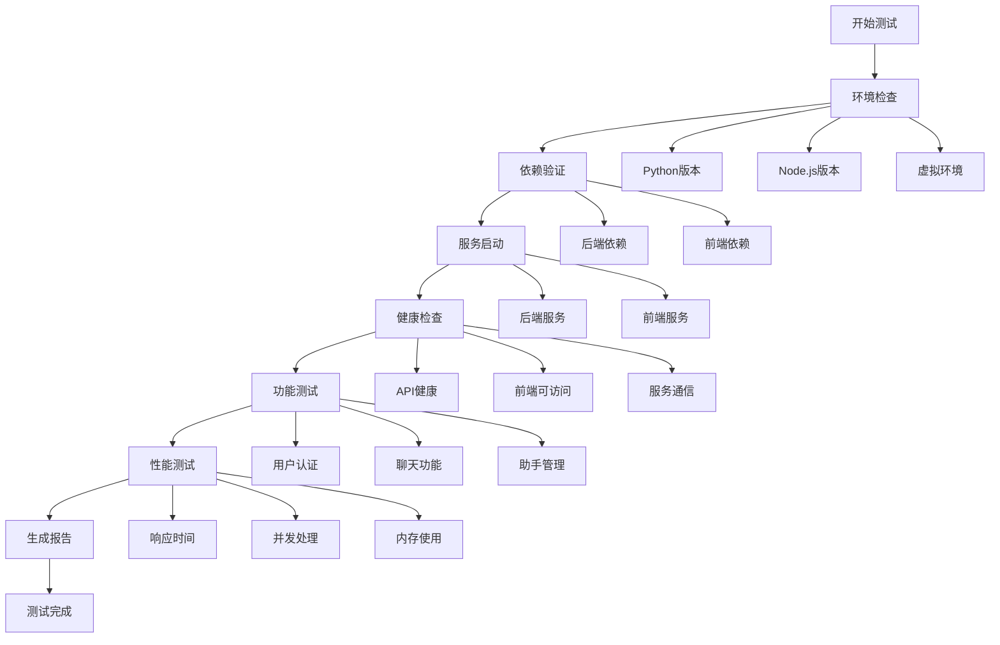

# Onyx 完整测试流程

## 🎯 测试流程概述

Onyx系统提供了完整的测试和验证流程，确保系统的稳定性和可靠性。

## 🧪 测试脚本分类

### 📋 基础验证测试
| 脚本 | 功能 | 位置 | 运行命令 |
|------|------|------|----------|
| `validate_requirements.py` | 验证后端依赖包 | `tests/backend/` | `python tests/backend/validate_requirements.py` |
| `test_import.py` | 测试模块导入 | `tests/backend/` | `python tests/backend/test_import.py` |
| `verify_installation.py` | 后端安装验证 | `tests/backend/` | `python tests/backend/verify_installation.py` |
| `verify_installation.js` | 前端安装验证 | `tests/frontend/` | `node tests/frontend/verify_installation.js` |

### 🏥 系统健康检查
| 脚本 | 功能 | 位置 | 运行命令 |
|------|------|------|----------|
| `health_check.py` | 系统健康状态检查 | `tests/` | `python tests/health_check.py` |
| `troubleshoot.py` | 故障诊断和排除 | `tests/` | `python tests/troubleshoot.py` |

### 🚀 功能和性能测试
| 脚本 | 功能 | 位置 | 运行命令 |
|------|------|------|----------|
| `e2e_test.py` | 端到端功能测试 | `tests/` | `python tests/e2e_test.py` |
| `performance_test.py` | 性能基准测试 | `tests/` | `python tests/performance_test.py` |
| `monitor_system.py` | 实时系统监控 | `tests/` | `python tests/monitor_system.py` |

### 🔄 集成测试
| 脚本 | 功能 | 位置 | 运行命令 |
|------|------|------|----------|
| `test_server.py` | 集成测试服务器 | `tests/integration/` | `python tests/integration/test_server.py` |
| `run_all_tests.py` | 运行所有测试 | `tests/` | `python tests/run_all_tests.py` |

## 📊 测试流程图



## 🔄 标准测试流程

### 1. 快速验证流程 (5分钟)
```bash
# 基础环境检查
python tests/troubleshoot.py

# 依赖验证
python tests/backend/validate_requirements.py
node tests/frontend/verify_installation.js

# 健康检查
python tests/health_check.py
```

### 2. 完整测试流程 (15分钟)
```bash
# 运行所有基础测试
python tests/run_all_tests.py

# 端到端功能测试
python tests/e2e_test.py

# 性能基准测试
python tests/performance_test.py
```

### 3. 持续监控流程
```bash
# 启动实时监控 (30秒间隔)
python tests/monitor_system.py

# 启动实时监控 (自定义间隔)
python tests/monitor_system.py 60
```

## 📈 测试指标和标准

### ✅ 通过标准

#### 基础验证
- ✅ 所有156个后端依赖包安装成功
- ✅ 所有93个前端依赖包安装成功
- ✅ 核心模块导入无错误

#### 健康检查
- ✅ 后端API响应时间 < 500ms
- ✅ 前端页面加载时间 < 2秒
- ✅ 所有核心API端点返回200状态

#### 功能测试
- ✅ 用户认证流程正常
- ✅ 聊天会话创建成功
- ✅ 消息发送接收正常
- ✅ 助手系统工作正常

#### 性能测试
- ✅ API平均响应时间 < 200ms
- ✅ 并发请求成功率 > 90%
- ✅ 系统内存使用 < 1GB
- ✅ CPU使用率 < 50%

### ⚠️ 警告标准

#### 性能警告
- ⚠️  API响应时间 > 1秒
- ⚠️  内存使用 > 85%
- ⚠️  CPU使用率 > 80%
- ⚠️  并发成功率 < 80%

#### 服务警告
- 🚨 服务离线超过30秒
- 🚨 连续5次健康检查失败
- 🚨 错误率 > 10%

## 🛠️ 故障排除指南

### 常见问题和解决方案

#### 1. 依赖安装失败
**问题**: pip install 或 npm install 失败
**解决方案**:
```bash
# 清理缓存重新安装
cd backend
pip cache purge
pip install -r requirements.txt

cd web  
npm cache clean --force
npm install
```

#### 2. 服务启动失败
**问题**: 后端或前端服务无法启动
**解决方案**:
```bash
# 检查端口占用
netstat -ano | findstr :8080
netstat -ano | findstr :3000

# 杀死占用进程
taskkill /PID <进程ID> /F

# 重新启动
python tests/integration/test_server.py
npm run dev
```

#### 3. 模块导入错误
**问题**: Python模块导入失败
**解决方案**:
```bash
# 检查虚拟环境
cd backend
venv\Scripts\activate

# 重新安装问题包
pip uninstall <package_name>
pip install <package_name>
```

#### 4. 前端构建错误
**问题**: Next.js构建失败
**解决方案**:
```bash
cd web
# 清理构建缓存
rm -rf .next
rm -rf node_modules
npm install
npm run build
```

## 📊 测试报告示例

### 健康检查报告
```
🏥 后端服务健康检查
✅ 健康 端口8080占用检查 (服务正在运行)
✅ 健康 健康检查端点 (状态: healthy) (45.23ms)
✅ 健康 API端点 /settings (正常响应) (32.15ms)

📊 测试结果: 15/15 通过
📈 成功率: 100.0%
⚡ 平均响应时间: 38.45ms
```

### 性能测试报告
```
⚡ API响应时间测试
✅ /health 平均: 25.3ms, 最小: 18.2ms, 最大: 45.1ms
✅ /settings 平均: 32.1ms, 最小: 24.5ms, 最大: 52.3ms

🔄 并发请求测试 (10线程, 每线程5请求)
📊 总请求数: 50
✅ 成功请求: 50
📈 成功率: 100.0%
⚡ 请求/秒: 15.23
```

## 🎯 最佳实践

### 开发阶段
1. **每次代码变更后运行基础验证**
2. **每日运行完整测试流程**
3. **使用实时监控观察性能变化**

### 部署阶段
1. **部署前运行完整测试套件**
2. **部署后立即运行健康检查**
3. **启用持续监控**

### 生产环境
1. **定期运行性能测试**
2. **设置自动化健康检查**
3. **配置告警通知**

---

**最后更新**: 2025年1月9日  
**维护者**: Onyx开发团队
