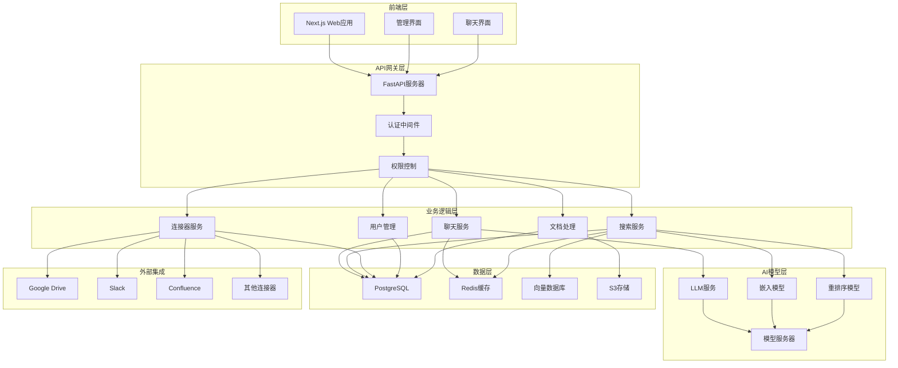

# Onyx 技术架构分析文档

## 项目概览

Onyx（原名Danswer）是一个开源的企业级AI搜索和聊天平台，提供与公司文档、应用程序和人员连接的AI助手功能。该项目采用现代化的微服务架构，支持多种LLM模型和40+种数据连接器。

### 核心特性
- **智能搜索**: 基于RAG（检索增强生成）的企业知识搜索
- **AI聊天**: 支持多种LLM模型的对话式AI助手
- **多源连接**: 支持Google Drive、Slack、Confluence等40+种连接器
- **权限控制**: 完整的RBAC权限管理和SSO集成
- **可扩展部署**: 支持从笔记本电脑到云端的多种部署方式

## 技术栈概览

### 后端技术栈
- **框架**: FastAPI (Python 3.11)
- **数据库**: PostgreSQL + Redis
- **AI/ML**: 
  - LangChain (AI工作流编排)
  - Transformers (模型推理)
  - Sentence Transformers (文本嵌入)
  - 支持OpenAI、Anthropic、Google等多种LLM
- **任务队列**: Celery
- **搜索引擎**: 自研向量搜索 + 传统搜索混合
- **文件存储**: S3兼容存储
- **监控**: Sentry + Prometheus

### 前端技术栈
- **框架**: Next.js 15 (React 18)
- **语言**: TypeScript
- **样式**: Tailwind CSS + Radix UI
- **状态管理**: React Context + SWR
- **表单处理**: Formik + Yup
- **图表**: Recharts
- **测试**: Jest + Playwright

### 基础设施
- **容器化**: Docker + Docker Compose
- **编排**: Kubernetes (可选)
- **CI/CD**: GitHub Actions
- **部署**: 支持AWS ECS、本地部署等多种方式

## 系统架构图

## 核心模块分析

### 1. 认证与授权系统
- **多种认证方式**: 支持基础认证、OAuth2、SAML、OIDC
- **权限模型**: 基于角色的访问控制(RBAC)
- **会话管理**: JWT令牌 + Redis会话存储
- **企业集成**: 支持SSO单点登录

### 2. 聊天系统
- **实时通信**: WebSocket + Server-Sent Events
- **多模型支持**: 统一的LLM接口抽象
- **上下文管理**: 对话历史和上下文窗口管理
- **流式响应**: 支持实时流式文本生成

### 3. 搜索与检索系统
- **混合搜索**: 向量搜索 + 关键词搜索 + 重排序
- **文档索引**: 自动文档处理和向量化
- **权限过滤**: 基于用户权限的搜索结果过滤
- **相关性优化**: 基于用户反馈的搜索优化

### 4. 连接器系统
- **统一接口**: 标准化的连接器接口设计
- **增量同步**: 支持增量数据同步和实时更新
- **错误处理**: 完善的错误重试和恢复机制
- **扩展性**: 插件化的连接器架构

## 数据流架构

### 文档处理流程
1. **数据获取**: 连接器从外部系统获取文档
2. **内容提取**: 解析各种文件格式(PDF、Word、HTML等)
3. **文本分块**: 智能文本分割和预处理
4. **向量化**: 生成文档嵌入向量
5. **索引存储**: 存储到向量数据库和关系数据库
6. **权限映射**: 维护文档访问权限

### 查询处理流程
1. **用户查询**: 接收用户搜索或聊天请求
2. **查询理解**: 查询意图识别和改写
3. **检索**: 混合搜索获取相关文档
4. **重排序**: 基于相关性重新排序结果
5. **生成**: LLM基于检索结果生成回答
6. **后处理**: 格式化和安全检查

## 性能与扩展性设计

### 缓存策略
- **多层缓存**: Redis缓存 + 应用层缓存
- **查询缓存**: 常见查询结果缓存
- **模型缓存**: AI模型推理结果缓存
- **静态资源**: CDN加速

### 负载均衡
- **水平扩展**: 支持多实例部署
- **服务分离**: API服务与模型服务分离
- **异步处理**: 后台任务队列处理重任务
- **数据库优化**: 读写分离和连接池

### 监控与观测
- **应用监控**: Sentry错误追踪
- **性能监控**: Prometheus指标收集
- **日志聚合**: 结构化日志记录
- **健康检查**: 服务健康状态监控

## 安全考虑

### 数据安全
- **传输加密**: HTTPS/TLS加密传输
- **存储加密**: 敏感数据加密存储
- **访问控制**: 细粒度权限控制
- **审计日志**: 完整的操作审计

### 应用安全
- **输入验证**: 严格的输入参数验证
- **SQL注入防护**: 参数化查询
- **XSS防护**: 内容安全策略(CSP)
- **CSRF防护**: CSRF令牌验证

## 部署架构

### 容器化部署
- **Docker镜像**: 多阶段构建优化
- **服务编排**: Docker Compose配置
- **环境隔离**: 开发/测试/生产环境分离
- **配置管理**: 环境变量和配置文件管理

### 云原生部署
- **Kubernetes**: Helm图表部署
- **服务网格**: 可选Istio集成
- **自动扩缩**: HPA水平扩展
- **存储**: 持久化卷和对象存储

## 开发工作流

### 代码质量
- **类型检查**: TypeScript + mypy
- **代码格式**: Prettier + Black
- **代码检查**: ESLint + Ruff
- **测试覆盖**: 单元测试 + 集成测试

### CI/CD流程
- **自动化测试**: GitHub Actions
- **代码审查**: Pull Request工作流
- **自动部署**: 多环境自动部署
- **版本管理**: 语义化版本控制

## 总结

Onyx采用了现代化的微服务架构设计，具有以下优势：

1. **技术先进**: 使用最新的AI技术栈和Web技术
2. **架构清晰**: 分层架构，职责分离明确
3. **扩展性强**: 支持水平扩展和插件化扩展
4. **安全可靠**: 完善的安全机制和错误处理
5. **部署灵活**: 支持多种部署方式和环境

该架构设计能够很好地支持企业级应用的需求，同时保持了良好的可维护性和扩展性。
