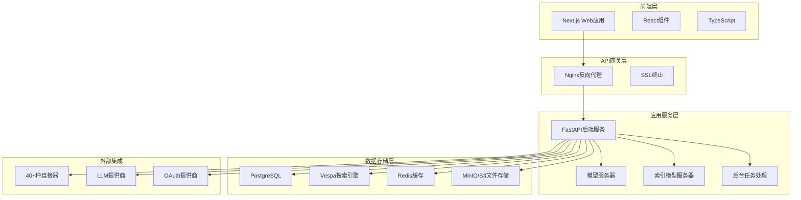
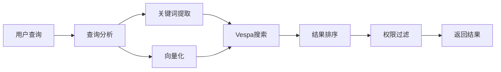
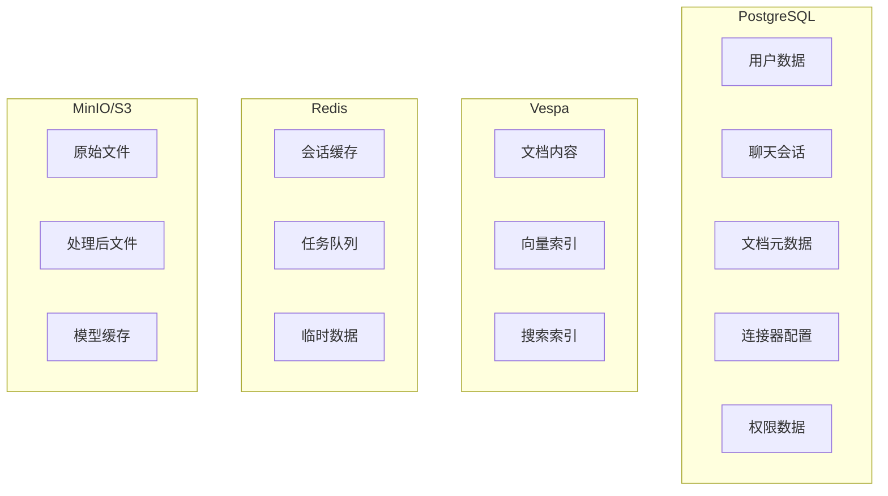
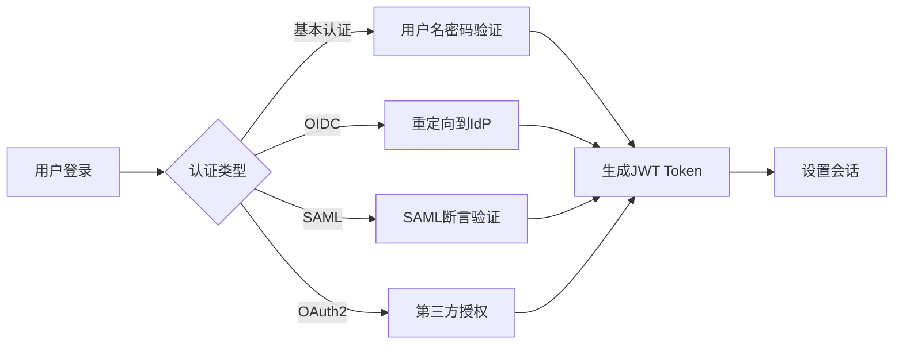

# Onyx 技术架构报告

## 1. 项目概述

Onyx（原名Danswer）是一个开源的企业级AI搜索和聊天平台，旨在连接企业的文档、应用和人员。该平台提供丰富的聊天界面，支持任意LLM选择，并通过40多个连接器保持知识和访问控制的同步。

### 1.1 核心特性
- **深度研究**：基于团队知识的深度搜索和分析
- **安全AI聊天**：支持任意LLM的安全聊天功能
- **多源连接**：支持40+种数据源连接器
- **自定义AI代理**：具有独特提示、知识和操作能力
- **灵活部署**：支持笔记本电脑、本地部署或云端部署

### 1.2 版本说明
- **社区版（CE）**：MIT许可证下免费提供
- **企业版（EE）**：包含面向大型组织的额外功能

## 2. 整体架构

### 2.1 架构概览

### 2.2 服务架构模式
- **微服务架构**：各功能模块独立部署和扩展
- **前后端分离**：前端和后端完全解耦
- **容器化部署**：基于Docker的容器化架构
- **事件驱动**：使用Celery进行异步任务处理

## 3. 技术栈详解

### 3.1 前端技术栈
- **框架**：Next.js 15.2.4（React 18.3.1）
- **语言**：TypeScript 5.0.3
- **UI组件库**：
  - Radix UI（无障碍组件）
  - Tailwind CSS（样式框架）
  - Headless UI
- **状态管理**：SWR（数据获取和缓存）
- **表单处理**：Formik + Yup
- **图标**：Phosphor Icons、Lucide React
- **测试**：Jest + Playwright
- **监控**：Sentry、PostHog

### 3.2 后端技术栈
- **框架**：FastAPI 0.115.12
- **语言**：Python 3.11+
- **异步处理**：Celery 5.5.1 + Redis
- **数据库ORM**：SQLAlchemy + Alembic（迁移）
- **认证**：FastAPI-Users 14.0.1
- **HTTP客户端**：httpx 0.27.0
- **AI/ML库**：
  - LangChain 0.3.23
  - LangGraph 0.2.72
  - LiteLLM 1.72.2
  - Hugging Face Hub 0.29.0

### 3.3 数据存储技术栈
- **关系数据库**：PostgreSQL 15.2
- **搜索引擎**：Vespa 8.526.15
- **缓存**：Redis 7.4
- **文件存储**：MinIO/AWS S3
- **向量数据库**：集成在Vespa中

### 3.4 基础设施技术栈
- **容器化**：Docker + Docker Compose
- **编排**：Kubernetes（Helm Charts）
- **反向代理**：Nginx 1.23.4
- **SSL证书**：Let's Encrypt + Certbot
- **监控**：Sentry、DataDog Trace
- **云平台**：AWS ECS Fargate支持

## 4. 核心功能模块

### 4.1 连接器系统
支持40+种数据源的连接器架构：

**主要连接器类型**：
- **文档系统**：Google Drive、Confluence、SharePoint、Notion
- **通信工具**：Slack、Microsoft Teams、Gmail
- **开发工具**：GitHub、Jira
- **CRM系统**：Salesforce、Zendesk
- **其他**：本地文件、网站、Dropbox等

**连接器架构特点**：
- 统一的连接器接口
- OAuth2/SAML认证支持
- 增量同步机制
- 权限继承和访问控制

### 4.2 搜索引擎模块
基于Vespa的企业级搜索引擎：

**核心功能**：
- 全文搜索
- 向量搜索（语义搜索）
- 混合搜索（关键词+语义）
- 实时索引更新
- 多语言支持

**搜索流程**：

### 4.3 AI聊天系统
支持多种LLM的智能聊天系统：

**支持的LLM**：
- OpenAI GPT系列
- Anthropic Claude
- Google Gemini
- 本地部署模型

**聊天功能**：
- 流式响应
- 上下文记忆
- 文档引用
- 多轮对话
- 自定义Persona

### 4.4 文档处理模块
智能文档处理和索引系统：

**处理流程**：
1. 文档获取（通过连接器）
2. 内容提取和清理
3. 文本分块（Chunking）
4. 向量化处理
5. 索引存储
6. 权限映射

**支持格式**：
- PDF、Word、Excel、PowerPoint
- HTML、Markdown
- 纯文本
- 图片（OCR处理）

## 5. 数据架构

### 5.1 数据存储架构

### 5.2 数据流转
1. **数据摄入**：连接器 → 文件存储 → 处理队列
2. **数据处理**：队列 → 文档处理 → 向量化 → 索引
3. **数据查询**：用户查询 → 搜索引擎 → 结果聚合 → 返回
4. **数据更新**：增量同步 → 差异检测 → 索引更新

## 6. 部署架构

### 6.1 Docker Compose部署
标准的容器化部署方案：

**核心服务**：
- `api_server`：FastAPI后端服务
- `web_server`：Next.js前端服务
- `background`：后台任务处理
- `inference_model_server`：推理模型服务
- `indexing_model_server`：索引模型服务
- `relational_db`：PostgreSQL数据库
- `index`：Vespa搜索引擎
- `cache`：Redis缓存
- `minio`：文件存储服务
- `nginx`：反向代理

### 6.2 Kubernetes部署
支持高可用和可扩展的K8s部署：

**特性**：
- Helm Charts支持
- 自动扩缩容
- 服务发现
- 配置管理
- 持久化存储

### 6.3 云平台部署
支持AWS ECS Fargate等云平台：

**优势**：
- 托管服务
- 自动扩展
- 高可用性
- 成本优化

## 7. 安全架构

### 7.1 认证系统
多种认证方式支持：

**认证类型**：
- **禁用认证**：开发环境使用
- **基本认证**：用户名密码
- **OIDC**：OpenID Connect
- **SAML**：企业级单点登录
- **OAuth2**：第三方登录

**认证流程**：

### 7.2 授权系统
基于角色的访问控制（RBAC）：

**权限模型**：
- **用户角色**：管理员、普通用户、只读用户
- **资源权限**：文档访问、连接器管理、系统配置
- **继承权限**：从数据源继承访问权限

**权限控制**：
- API级别权限检查
- 文档级别访问控制
- 连接器权限映射
- 外部组权限同步

### 7.3 数据安全
多层次的数据保护：

**传输安全**：
- HTTPS/TLS加密
- API密钥认证
- OAuth令牌保护

**存储安全**：
- 数据库连接加密
- 敏感信息加密存储
- 文件存储访问控制

**隐私保护**：
- 个人信息脱敏
- 访问日志记录
- 数据保留策略

## 8. 扩展性设计

### 8.1 多租户架构
支持多租户的SaaS部署：

**租户隔离**：
- 数据库Schema隔离
- 文件存储隔离
- 搜索索引隔离
- 配置隔离

**租户管理**：
- 动态租户创建
- 资源配额管理
- 计费和监控
- 租户间安全隔离

### 8.2 水平扩展
支持大规模部署的扩展能力：

**服务扩展**：
- API服务器集群
- 模型服务器集群
- 后台任务分布式处理
- 负载均衡

**数据扩展**：
- PostgreSQL读写分离
- Vespa集群部署
- Redis集群
- 分布式文件存储

### 8.3 性能优化
多层次的性能优化策略：

**缓存策略**：
- Redis应用缓存
- 模型推理缓存
- 搜索结果缓存
- CDN静态资源缓存

**异步处理**：
- Celery任务队列
- 文档处理异步化
- 索引更新异步化
- 通知系统异步化

## 9. 监控和运维

### 9.1 监控体系
全方位的系统监控：

**应用监控**：
- Sentry错误追踪
- PostHog用户行为分析
- DataDog APM性能监控
- 自定义指标收集

**基础设施监控**：
- 容器资源监控
- 数据库性能监控
- 搜索引擎监控
- 网络和存储监控

### 9.2 日志管理
结构化的日志管理系统：

**日志类型**：
- 应用日志
- 访问日志
- 错误日志
- 审计日志

**日志处理**：
- 集中化收集
- 结构化存储
- 实时分析
- 长期归档

### 9.3 运维自动化
DevOps最佳实践：

**CI/CD流程**：
- 自动化构建
- 自动化测试
- 自动化部署
- 回滚机制

**运维工具**：
- Docker容器化
- Kubernetes编排
- Helm包管理
- 监控告警

## 10. 技术路线图

### 10.1 当前版本特性
- 40+种连接器支持
- 多种LLM集成
- 企业级安全认证
- 可扩展部署架构

### 10.2 未来发展方向
- **新检索方法**：StructRAG、LightGraphRAG等
- **个性化搜索**：基于用户行为的个性化
- **组织理解**：专家定位和推荐
- **代码搜索**：源代码智能搜索
- **结构化查询**：SQL和结构化查询语言支持

## 11. 总结

Onyx采用现代化的微服务架构，具备以下核心优势：

1. **技术先进性**：采用最新的AI和搜索技术
2. **架构灵活性**：支持多种部署方式和扩展模式
3. **安全可靠性**：企业级安全和权限控制
4. **开放生态**：丰富的连接器和LLM支持
5. **运维友好**：完善的监控和自动化运维

该架构设计能够满足从小型团队到大型企业的不同需求，是一个成熟的企业级AI搜索和聊天平台解决方案。
