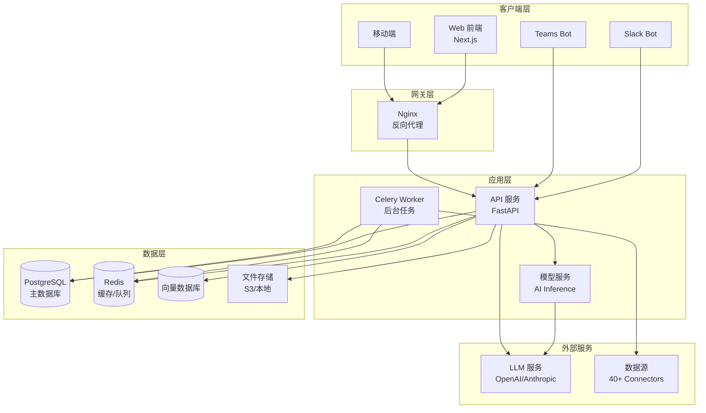
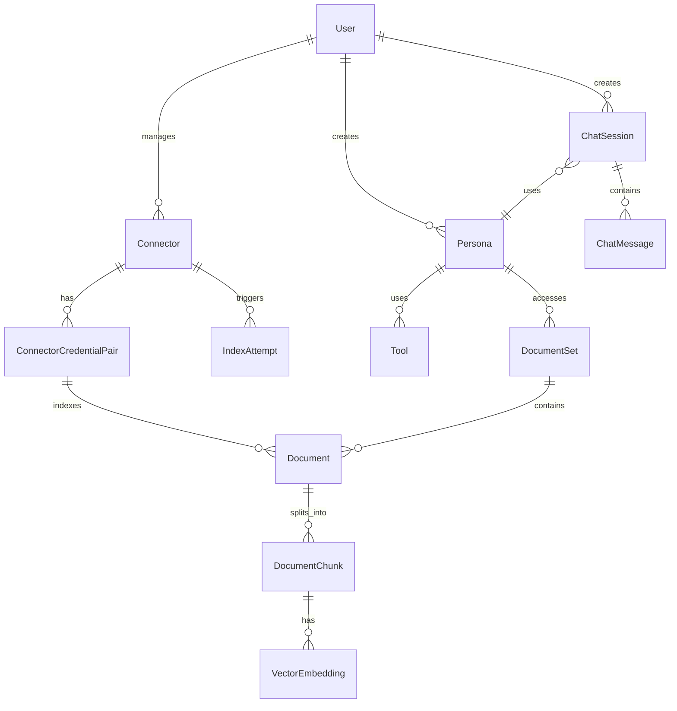
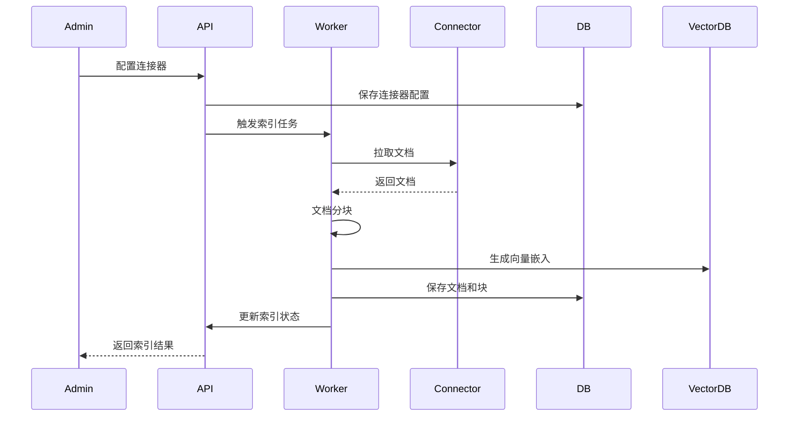
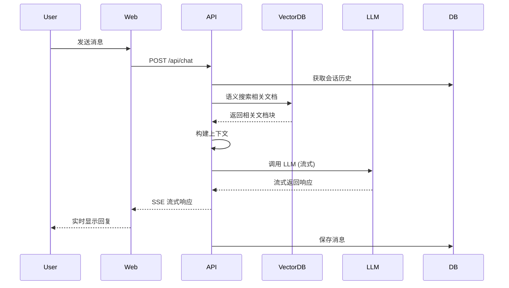
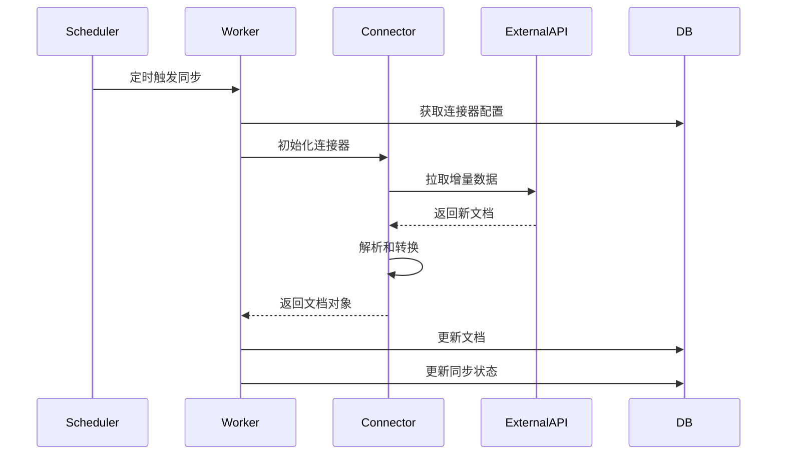

# Onyx 技术架构文档

## 1. 项目概述

**Onyx** (原名 Danswer) 是一个开源的企业级 AI 搜索和知识管理平台,连接公司的文档、应用和人员。它提供功能丰富的聊天界面,支持任意 LLM,并通过 40+ 连接器保持知识和访问控制同步。

### 1.1 核心特性
- 🔍 深度研究团队知识库
- 💬 支持任意 LLM 的安全 AI 聊天
- 🔌 40+ 数据源连接器
- 🤖 自定义 AI 代理(Agents)
- 🔐 企业级安全特性(SSO、RBAC、加密)
- 📊 知识管理和分析
- 🚀 可扩展部署(笔记本、本地、云端)

---

## 2. 技术栈总览

### 2.1 后端技术栈
| 技术类别 | 技术选型 | 版本 | 用途 |
|---------|---------|------|------|
| **Web 框架** | FastAPI | 0.115.12 | 高性能异步 API 框架 |
| **数据库** | PostgreSQL | 14+ | 主数据库 |
| **缓存/队列** | Redis | 7+ | 缓存、会话、消息队列 |
| **ORM** | SQLAlchemy | 2.0.41 | 数据库 ORM |
| **数据库迁移** | Alembic | 1.10.4 | 数据库版本管理 |
| **异步任务** | Celery | 5.5.1 | 后台任务队列 |
| **AI 框架** | LangChain | 0.3.23 | AI 应用框架 |
| **LLM SDK** | OpenAI, Anthropic, Cohere | 最新 | 多 LLM 支持 |
| **向量搜索** | Sentence Transformers | 5.1.0 | 语义搜索 |
| **深度学习** | PyTorch | 2.8.0 | 模型推理 |
| **文档处理** | Unstructured | 0.18.11 | 多格式文档解析 |
| **认证** | FastAPI-Users | 14.0.1 | 用户认证系统 |
| **监控** | Prometheus, Sentry | - | 性能监控和错误追踪 |

### 2.2 前端技术栈
| 技术类别 | 技术选型 | 版本 | 用途 |
|---------|---------|------|------|
| **框架** | Next.js | 15.2.4 | React 全栈框架 |
| **UI 库** | React | 18.3.1 | UI 组件库 |
| **样式** | TailwindCSS | 3.3.1 | 原子化 CSS 框架 |
| **组件库** | Radix UI | 最新 | 无障碍 UI 组件 |
| **状态管理** | SWR | 2.1.5 | 数据获取和缓存 |
| **表单** | Formik | 2.2.9 | 表单管理 |
| **Markdown** | React-Markdown | 9.0.1 | Markdown 渲染 |
| **图表** | Recharts | 2.13.1 | 数据可视化 |
| **监控** | Sentry | 8.50.0 | 错误追踪 |
| **分析** | PostHog | 1.176.0 | 用户行为分析 |

### 2.3 基础设施
- **容器化**: Docker, Docker Compose
- **编排**: Kubernetes (Helm Charts)
- **云平台**: AWS ECS Fargate
- **反向代理**: Nginx
- **CI/CD**: GitHub Actions

---

## 3. 系统架构

### 3.1 整体架构图



### 3.2 服务组件说明

#### 3.2.1 API 服务 (FastAPI)
- **端口**: 8080
- **职责**:
  - RESTful API 接口
  - 用户认证和授权
  - 聊天会话管理
  - 文档检索和搜索
  - 连接器管理
  - Persona/Agent 配置
- **资源限制**: 2 CPU, 2GB 内存

#### 3.2.2 模型服务 (Model Server)
- **端口**: 9000
- **职责**:
  - AI 模型推理
  - 向量嵌入生成
  - 语义搜索
  - 模型缓存管理
- **资源限制**: 2 CPU, 4GB 内存

#### 3.2.3 Celery Worker
- **职责**:
  - 文档索引任务
  - 连接器数据同步
  - 定时任务执行
  - 批量处理
- **资源限制**: 1 CPU, 1GB 内存

#### 3.2.4 Web 前端 (Next.js)
- **端口**: 3000
- **职责**:
  - 用户界面渲染
  - SSR/SSG 页面生成
  - API 调用封装
  - 状态管理
- **资源限制**: 1 CPU, 512MB 内存

#### 3.2.5 Nginx 反向代理
- **端口**: 80 (HTTP), 443 (HTTPS)
- **职责**:
  - 请求路由
  - 负载均衡
  - SSL/TLS 终止
  - 静态资源服务
- **资源限制**: 0.5 CPU, 256MB 内存

---

## 4. 后端模块架构

### 4.1 目录结构

```
backend/
├── onyx/                      # 核心业务代码
│   ├── access/               # 访问控制
│   ├── agents/               # AI 代理
│   │   └── agent_search/     # 代理搜索实现
│   ├── auth/                 # 认证授权
│   ├── background/           # 后台任务
│   ├── chat/                 # 聊天功能
│   ├── configs/              # 配置管理
│   ├── connectors/           # 数据源连接器 (47+)
│   │   ├── google_drive/
│   │   ├── slack/
│   │   ├── confluence/
│   │   ├── salesforce/
│   │   ├── github/
│   │   ├── jira/
│   │   └── ...
│   ├── context/              # 上下文管理
│   ├── db/                   # 数据库模型和操作
│   │   ├── models.py
│   │   ├── engine/
│   │   └── ...
│   ├── document_index/       # 文档索引
│   ├── federated_connectors/ # 联邦连接器
│   ├── file_processing/      # 文件处理
│   ├── file_store/           # 文件存储
│   ├── indexing/             # 索引管理
│   ├── kg/                   # 知识图谱
│   ├── llm/                  # LLM 集成
│   ├── natural_language_processing/ # NLP
│   ├── onyxbot/              # Bot 集成
│   ├── prompts/              # 提示词管理
│   ├── redis/                # Redis 操作
│   ├── secondary_llm_flows/ # 辅助 LLM 流程
│   ├── seeding/              # 数据初始化
│   ├── server/               # API 路由
│   │   ├── api_key/
│   │   ├── documents/
│   │   ├── features/
│   │   ├── manage/
│   │   ├── query_and_chat/
│   │   └── ...
│   ├── tools/                # 工具集成
│   ├── utils/                # 工具函数
│   └── main.py               # 应用入口
├── alembic/                  # 数据库迁移
├── ee/                       # 企业版功能
├── model_server/             # 模型服务
├── requirements/             # 依赖管理
├── scripts/                  # 脚本工具
└── tests/                    # 测试代码
```

### 4.2 核心模块详解

#### 4.2.1 Connectors (连接器模块)
**职责**: 从各种数据源拉取和同步数据

**支持的连接器** (47+):
- **协作工具**: Slack, Microsoft Teams, Discord, Zulip
- **文档管理**: Google Drive, Sharepoint, Dropbox, Confluence, Notion
- **项目管理**: Jira, Asana, Linear, ClickUp, Productboard
- **客户支持**: Zendesk, Freshdesk, Gong
- **代码托管**: GitHub, GitLab
- **CRM**: Salesforce, HubSpot
- **知识库**: GitBook, Guru, Document360, MediaWiki
- **其他**: Gmail, Web Scraping, Local Files, etc.

**核心接口**:
```python
# backend/onyx/connectors/interfaces.py
class LoadConnector(ABC):
    @abstractmethod
    def load_credentials(self, credentials: dict) -> dict:
        pass
    
    @abstractmethod
    def load_from_state(self) -> GenerateDocumentsOutput:
        pass

class PollConnector(LoadConnector):
    @abstractmethod
    def poll_source(self, start: datetime, end: datetime) -> GenerateDocumentsOutput:
        pass
```

#### 4.2.2 Agents (AI 代理模块)
**职责**: 实现智能代理搜索和推理

**核心功能**:
- 多步推理
- 工具调用
- 上下文管理
- 搜索策略

#### 4.2.3 Chat (聊天模块)
**职责**: 管理聊天会话和消息

**核心功能**:
- 会话管理
- 消息历史
- 流式响应
- 上下文窗口管理

#### 4.2.4 Document Index (文档索引模块)
**职责**: 文档索引和检索

**核心功能**:
- 向量索引
- 全文搜索
- 混合检索
- 重排序

#### 4.2.5 LLM (大语言模型模块)
**职责**: LLM 集成和调用

**支持的 LLM**:
- OpenAI (GPT-3.5, GPT-4, GPT-4 Turbo)
- Anthropic (Claude 3 系列)
- Google (Gemini)
- Cohere
- Mistral AI
- 本地模型 (通过 LiteLLM)

#### 4.2.6 Server (API 路由模块)
**职责**: 定义所有 API 端点

**主要路由**:
- `/api/chat` - 聊天接口
- `/api/query` - 查询接口
- `/api/documents` - 文档管理
- `/api/connectors` - 连接器管理
- `/api/credentials` - 凭证管理
- `/api/personas` - Persona 管理
- `/api/tools` - 工具管理
- `/api/admin` - 管理接口
- `/api/auth` - 认证接口

---

## 5. 前端模块架构

### 5.1 目录结构

```
web/
├── src/
│   ├── app/                  # Next.js App Router
│   │   ├── admin/           # 管理后台
│   │   │   ├── connectors/  # 连接器管理
│   │   │   ├── documents/   # 文档管理
│   │   │   ├── personas/    # Persona 管理
│   │   │   ├── tools/       # 工具管理
│   │   │   ├── users/       # 用户管理
│   │   │   └── settings/    # 系统设置
│   │   ├── assistants/      # AI 助手
│   │   ├── auth/            # 认证页面
│   │   │   ├── login/
│   │   │   ├── signup/
│   │   │   └── oauth/
│   │   ├── chat/            # 聊天界面
│   │   │   ├── [chatId]/    # 聊天会话
│   │   │   └── sessionSidebar/
│   │   ├── search/          # 搜索界面
│   │   ├── ee/              # 企业版功能
│   │   ├── api/             # API 路由
│   │   ├── layout.tsx       # 根布局
│   │   └── page.tsx         # 首页
│   ├── components/          # 可复用组件
│   │   ├── admin/           # 管理组件
│   │   ├── chat/            # 聊天组件
│   │   ├── search/          # 搜索组件
│   │   ├── ui/              # UI 基础组件
│   │   └── ...
│   ├── lib/                 # 工具库
│   │   ├── api/             # API 调用
│   │   ├── hooks/           # 自定义 Hooks
│   │   ├── types/           # TypeScript 类型
│   │   └── utils/           # 工具函数
│   └── hooks/               # 全局 Hooks
├── public/                  # 静态资源
├── tailwind.config.js       # TailwindCSS 配置
├── next.config.js           # Next.js 配置
└── package.json             # 依赖配置
```

### 5.2 核心页面模块

#### 5.2.1 Chat (聊天界面)
- **路径**: `/chat`
- **功能**:
  - 多会话管理
  - 实时流式响应
  - 文档引用展示
  - Persona 切换
  - 工具调用可视化

#### 5.2.2 Admin (管理后台)
- **路径**: `/admin`
- **功能**:
  - 连接器配置
  - 文档集管理
  - Persona 创建和编辑
  - 用户和权限管理
  - 系统设置

#### 5.2.3 Search (搜索界面)
- **路径**: `/search`
- **功能**:
  - 语义搜索
  - 过滤器
  - 搜索结果展示

---

## 6. 数据库架构

### 6.1 核心数据模型



### 6.2 主要数据表

| 表名 | 说明 | 关键字段 |
|-----|------|---------|
| `user` | 用户表 | id, email, hashed_password, role |
| `chat_session` | 聊天会话 | id, user_id, persona_id, created_at |
| `chat_message` | 聊天消息 | id, session_id, message, message_type |
| `connector` | 连接器配置 | id, name, source, connector_specific_config |
| `credential` | 凭证信息 | id, credential_json, user_id |
| `connector_credential_pair` | 连接器-凭证对 | connector_id, credential_id |
| `document` | 文档 | id, semantic_id, source, metadata |
| `document_chunk` | 文档块 | id, document_id, chunk_id, content |
| `index_attempt` | 索引任务 | id, connector_id, status, time_started |
| `persona` | Persona 配置 | id, name, description, system_prompt |
| `tool` | 工具定义 | id, name, description, definition |
| `document_set` | 文档集 | id, name, description |

### 6.3 多租户支持
- 使用 PostgreSQL Schema 实现多租户隔离
- `alembic` - 公共表迁移
- `alembic_tenants` - 租户表迁移

---

## 7. 部署架构

### 7.1 Docker Compose 部署

**服务组件**:
1. **postgres** - PostgreSQL 14
2. **redis** - Redis 7
3. **api-backend** - FastAPI 应用
4. **model-server** - AI 模型服务
5. **celery-worker** - 后台任务
6. **web-frontend** - Next.js 前端
7. **nginx-proxy** - Nginx 反向代理

**网络拓扑**:
```
Internet
    ↓
Nginx (80/443)
    ↓
├─→ Web Frontend (3000)
└─→ API Backend (8080)
        ↓
    ├─→ Model Server (9000)
    ├─→ PostgreSQL (5432)
    ├─→ Redis (6379)
    └─→ Celery Worker
```

### 7.2 Kubernetes 部署

**Helm Chart 结构**:
```
deployment/helm/
├── Chart.yaml
├── values.yaml
├── templates/
│   ├── api-deployment.yaml
│   ├── model-server-deployment.yaml
│   ├── worker-deployment.yaml
│   ├── web-deployment.yaml
│   ├── postgres-statefulset.yaml
│   ├── redis-statefulset.yaml
│   ├── ingress.yaml
│   └── services.yaml
```

**关键配置**:
- **HPA**: 自动水平扩展
- **PVC**: 持久化存储
- **ConfigMap**: 配置管理
- **Secret**: 敏感信息管理
- **Ingress**: 流量入口

### 7.3 AWS ECS Fargate 部署

**服务定义**:
- Task Definition for each service
- Application Load Balancer
- RDS PostgreSQL
- ElastiCache Redis
- S3 for file storage
- CloudWatch for monitoring

---

## 8. 核心工作流程

### 8.1 文档索引流程



### 8.2 聊天查询流程



### 8.3 连接器同步流程



---

## 9. 安全架构

### 9.1 认证机制
- **Basic Auth**: 用户名/密码
- **OAuth 2.0**: Google OAuth
- **SSO**: OIDC/SAML (企业版)
- **API Key**: 程序化访问

### 9.2 授权模型
- **RBAC**: 基于角色的访问控制
  - Admin: 全局管理员
  - User: 普通用户
  - Limited: 受限用户
- **文档级权限**: 基于连接器的访问控制
- **Persona 权限**: 限制 Persona 访问的文档集

### 9.3 数据安全
- **传输加密**: HTTPS/TLS
- **存储加密**: 凭证加密存储
- **密码哈希**: Argon2
- **Token 管理**: JWT with refresh tokens

---

## 10. 性能优化

### 10.1 缓存策略
- **Redis 缓存**:
  - 会话数据
  - LLM 响应缓存
  - 向量搜索结果缓存
- **浏览器缓存**: 静态资源 CDN

### 10.2 数据库优化
- **连接池**: SQLAlchemy 连接池
- **读写分离**: 只读副本
- **索引优化**: 关键字段索引
- **分页查询**: 避免大结果集

### 10.3 异步处理
- **Celery 任务队列**: 耗时操作异步化
- **FastAPI 异步**: 异步 I/O
- **流式响应**: SSE 流式传输

---

## 11. 监控和可观测性

### 11.1 指标监控
- **Prometheus**: 应用指标
  - 请求延迟
  - 错误率
  - 吞吐量
  - 资源使用
- **Grafana**: 可视化仪表盘

### 11.2 日志管理
- **结构化日志**: JSON 格式
- **日志级别**: DEBUG, INFO, WARNING, ERROR
- **日志聚合**: 集中式日志收集

### 11.3 错误追踪
- **Sentry**: 前后端错误追踪
- **堆栈跟踪**: 详细错误上下文

### 11.4 性能追踪
- **OpenTelemetry**: 分布式追踪
- **慢查询日志**: 数据库性能分析

---

## 12. 扩展性设计

### 12.1 水平扩展
- **无状态服务**: API 服务可水平扩展
- **负载均衡**: Nginx/ALB
- **数据库分片**: 多租户隔离

### 12.2 插件化架构
- **连接器插件**: 标准接口,易于扩展
- **工具插件**: 自定义工具集成
- **LLM 插件**: 支持任意 LLM

### 12.3 配置化
- **环境变量**: 12-factor app
- **动态配置**: 数据库配置
- **Feature Flags**: 功能开关

---

## 13. 开发工作流

### 13.1 本地开发
```bash
# 后端开发
cd backend
python -m venv venv
source venv/bin/activate
pip install -r requirements.txt
uvicorn onyx.main:app --reload

# 前端开发
cd web
npm install
npm run dev
```

### 13.2 测试
- **单元测试**: pytest (后端), jest (前端)
- **集成测试**: API 测试
- **E2E 测试**: Playwright

### 13.3 代码质量
- **Linting**: ESLint, Black
- **Type Checking**: TypeScript, mypy
- **Pre-commit Hooks**: 代码格式化

---

## 14. 技术债务和未来规划

### 14.1 当前技术债务
- 部分模块测试覆盖率不足
- 某些 API 响应时间较长
- 文档需要持续更新

### 14.2 未来技术规划
- **新检索方法**: StructRAG, LightGraphRAG
- **个性化搜索**: 基于用户行为
- **组织理解**: 专家推荐
- **代码搜索**: 代码语义搜索
- **SQL 查询**: 结构化查询语言

---

## 15. 总结

Onyx 是一个架构清晰、模块化设计的企业级 AI 搜索平台:

### 15.1 架构优势
✅ **前后端分离**: Next.js + FastAPI
✅ **微服务化**: 服务职责清晰
✅ **可扩展性**: 插件化连接器和工具
✅ **高性能**: 异步处理 + 缓存优化
✅ **企业级**: 安全、权限、多租户
✅ **云原生**: 容器化 + K8s 支持

### 15.2 技术亮点
- 🚀 **40+ 连接器**: 覆盖主流企业应用
- 🤖 **多 LLM 支持**: OpenAI, Anthropic, Google 等
- 🔍 **混合检索**: 向量搜索 + 全文搜索
- 💬 **流式响应**: 实时 AI 对话体验
- 🔐 **企业安全**: SSO, RBAC, 加密
- 📊 **可观测性**: 完善的监控和日志

### 15.3 适用场景
- 企业知识管理
- 智能客服系统
- 内部文档搜索
- AI 助手平台
- 团队协作工具

---

**文档版本**: v1.0
**最后更新**: 2025-01-24
**维护者**: Onyx Development Team
