# Onyx混合检索算法实现详解

## 🎯 概述

本文档深入解析Onyx工程中混合检索算法的核心实现，详细说明向量检索与全文检索的融合机制、评分算法和优化策略。

## 📊 混合检索架构图

```mermaid
graph TB
    subgraph "查询处理"
        A[用户查询] --> B[查询预处理]
        B --> C[关键词提取]
        B --> D[向量化]
    end
    
    subgraph "并行检索"
        C --> E[BM25关键词检索]
        D --> F[向量相似度检索]
        E --> G[关键词候选集]
        F --> H[向量候选集]
    end
    
    subgraph "混合评分"
        G --> I[BM25分数标准化]
        H --> J[向量分数标准化]
        I --> K[加权融合]
        J --> K
        K --> L[最终排序]
    end
    
    subgraph "后处理"
        L --> M[时间衰减]
        M --> N[文档提升]
        N --> O[权限过滤]
        O --> P[返回结果]
    end
```



## 🔍 核心算法实现

### 1. 混合检索主函数

<augment_code_snippet path="backend/onyx/document_index/vespa/index.py" mode="EXCERPT">
```python
def hybrid_retrieval(
    self,
    query: str,
    query_embedding: Embedding,
    final_keywords: list[str] | None,
    filters: IndexFilters,
    hybrid_alpha: float,  # 关键参数：混合权重
    time_decay_multiplier: float,
    num_to_retrieve: int,
    ranking_profile_type: QueryExpansionType,
    offset: int = 0,
    title_content_ratio: float | None = TITLE_CONTENT_RATIO,
) -> list[InferenceChunkUncleaned]:
```
</augment_code_snippet>

### 2. YQL查询构建策略

混合检索通过构建复合YQL查询实现多路径并行检索：

```python
# 构建混合检索YQL
yql = (
    YQL_BASE.format(index_name=self.index_name)
    + vespa_where_clauses
    + f"(({{targetHits: {target_hits}}}nearestNeighbor(embeddings, query_embedding)) "
    + f"or ({{targetHits: {target_hits}}}nearestNeighbor(title_embedding, query_embedding)) "
    + 'or ({grammar: "weakAnd"}userInput(@query)) '
    + f'or ({{defaultIndex: "{CONTENT_SUMMARY}"}}userInput(@query)))'
)
```

**查询路径解析**：
1. `nearestNeighbor(embeddings, query_embedding)` - 内容向量检索
2. `nearestNeighbor(title_embedding, query_embedding)` - 标题向量检索  
3. `{grammar: "weakAnd"}userInput(@query)` - 弱AND关键词检索
4. `{defaultIndex: "content_summary"}userInput(@query)` - 内容摘要检索

### 3. Ranking Profile选择逻辑

```python
# 根据查询扩展类型选择ranking profile
if ranking_profile_type == QueryExpansionType.KEYWORD:
    ranking_profile = f"hybrid_search_keyword_base_{len(query_embedding)}"
else:
    ranking_profile = f"hybrid_search_semantic_base_{len(query_embedding)}"
```

**Profile差异**：
- **语义优先**: first-phase使用向量相似度筛选
- **关键词优先**: first-phase使用BM25分数筛选

## 🧮 评分算法详解

### 1. 混合评分公式

Vespa中的混合评分在global-phase阶段计算：

```vespa
global-phase {
    expression {
        (
            # 向量相似度分数 (权重: α)
            query(alpha) * (
                (query(title_content_ratio) * normalize_linear(title_vector_score))
                +
                ((1 - query(title_content_ratio)) * normalize_linear(closeness(field, embeddings)))
            )
        )
        +
        # 关键词相似度分数 (权重: 1-α)
        (
            (1 - query(alpha)) * (
                (query(title_content_ratio) * normalize_linear(bm25(title)))
                +
                ((1 - query(title_content_ratio)) * normalize_linear(bm25(content)))
            )
        )
    }
    # 应用提升因子
    * document_boost
    * recency_bias  
    * aggregated_chunk_boost
}
```

### 2. 评分组件分析

#### 向量相似度计算

```python
def calculate_vector_score(
    query_embedding: list[float],
    doc_embedding: list[float],
    title_embedding: list[float] | None,
    title_content_ratio: float
) -> float:
    """计算向量相似度分数"""
    
    # 内容向量相似度
    content_similarity = cosine_similarity(query_embedding, doc_embedding)
    
    # 标题向量相似度
    if title_embedding:
        title_similarity = cosine_similarity(query_embedding, title_embedding)
        # 取最大值避免无关标题影响
        vector_score = max(content_similarity, title_similarity)
    else:
        vector_score = content_similarity
    
    # 加权组合
    final_score = (
        title_content_ratio * title_similarity +
        (1 - title_content_ratio) * content_similarity
    )
    
    return final_score
```

#### BM25关键词评分

```python
def calculate_bm25_score(
    query_terms: list[str],
    title: str,
    content: str,
    title_content_ratio: float,
    k1: float = 1.2,
    b: float = 0.75
) -> float:
    """计算BM25关键词评分"""
    
    # 标题BM25分数
    title_score = bm25_score(query_terms, title, k1, b)
    
    # 内容BM25分数
    content_score = bm25_score(query_terms, content, k1, b)
    
    # 加权组合
    final_score = (
        title_content_ratio * title_score +
        (1 - title_content_ratio) * content_score
    )
    
    return final_score

def bm25_score(terms: list[str], text: str, k1: float, b: float) -> float:
    """标准BM25评分实现"""
    # 文档长度标准化
    doc_length = len(text.split())
    avg_doc_length = 500  # 假设平均文档长度
    
    score = 0.0
    for term in terms:
        tf = text.lower().count(term.lower())  # 词频
        idf = calculate_idf(term)  # 逆文档频率
        
        # BM25公式
        term_score = idf * (tf * (k1 + 1)) / (
            tf + k1 * (1 - b + b * (doc_length / avg_doc_length))
        )
        score += term_score
    
    return score
```

### 3. 分数标准化

```python
def normalize_linear(score: float, min_score: float = 0.0, max_score: float = 1.0) -> float:
    """线性标准化到[0,1]区间"""
    if max_score == min_score:
        return 0.0
    return (score - min_score) / (max_score - min_score)

def normalize_scores_batch(scores: list[float]) -> list[float]:
    """批量标准化分数"""
    if not scores:
        return []
    
    min_score = min(scores)
    max_score = max(scores)
    
    return [normalize_linear(score, min_score, max_score) for score in scores]
```

## ⚖️ 权重参数优化

### 1. Alpha参数调优策略

```python
class HybridAlphaOptimizer:
    """混合检索Alpha参数优化器"""
    
    def __init__(self):
        self.query_patterns = {
            "factual": 0.3,      # 事实性查询偏向关键词
            "conceptual": 0.7,   # 概念性查询偏向语义
            "navigational": 0.2, # 导航性查询偏向关键词
            "informational": 0.5 # 信息性查询平衡
        }
    
    def optimize_alpha(
        self,
        query: str,
        query_type: str | None = None,
        user_feedback: dict | None = None
    ) -> float:
        """动态优化Alpha参数"""
        
        # 基于查询类型
        if query_type and query_type in self.query_patterns:
            base_alpha = self.query_patterns[query_type]
        else:
            base_alpha = self.classify_query_type(query)
        
        # 基于查询长度调整
        query_length = len(query.split())
        if query_length <= 2:
            base_alpha *= 0.6  # 短查询偏向关键词
        elif query_length >= 8:
            base_alpha *= 1.4  # 长查询偏向语义
        
        # 基于用户反馈调整
        if user_feedback:
            base_alpha = self.adjust_by_feedback(base_alpha, user_feedback)
        
        return max(0.0, min(1.0, base_alpha))
    
    def classify_query_type(self, query: str) -> float:
        """自动分类查询类型"""
        query_lower = query.lower()
        
        # 事实性查询特征
        factual_keywords = ["what", "when", "where", "who", "how many"]
        if any(keyword in query_lower for keyword in factual_keywords):
            return 0.3
        
        # 概念性查询特征
        conceptual_keywords = ["why", "how", "explain", "concept", "theory"]
        if any(keyword in query_lower for keyword in conceptual_keywords):
            return 0.7
        
        # 默认平衡
        return 0.5
```

### 2. 标题内容比例优化

```python
def optimize_title_content_ratio(source_type: str, document_structure: dict) -> float:
    """优化标题内容比例"""
    
    # 基于数据源类型的基础比例
    base_ratios = {
        "confluence": 0.4,   # Wiki文档标题重要
        "notion": 0.4,       # 笔记文档标题重要
        "slack": 0.1,        # 聊天消息标题不重要
        "email": 0.3,        # 邮件标题中等重要
        "pdf": 0.5,          # PDF文档标题很重要
        "web": 0.3,          # 网页标题中等重要
    }
    
    base_ratio = base_ratios.get(source_type, 0.3)
    
    # 基于文档结构调整
    if document_structure:
        title_length = len(document_structure.get("title", ""))
        content_length = len(document_structure.get("content", ""))
        
        # 标题过短或过长时降低权重
        if title_length < 10 or title_length > 200:
            base_ratio *= 0.7
        
        # 内容过短时提高标题权重
        if content_length < 100:
            base_ratio *= 1.3
    
    return max(0.1, min(0.6, base_ratio))
```

## 🔄 多路径检索融合

### 1. 查询扩展策略

<augment_code_snippet path="backend/onyx/context/search/retrieval/search_runner.py" mode="EXCERPT">
```python
# 关键词扩展检索
top_keyword_chunks_thread = run_in_background(
    document_index.hybrid_retrieval,
    query.expanded_queries.keywords_expansions[0],
    keyword_embeddings[0],
    query.processed_keywords,
    query.filters,
    HYBRID_ALPHA_KEYWORD,  # 关键词权重0.4
    query.recency_bias_multiplier,
    query.num_hits,
    QueryExpansionType.KEYWORD,
    query.offset,
)

# 语义扩展检索
top_semantic_chunks_thread = run_in_background(
    document_index.hybrid_retrieval,
    query.expanded_queries.semantic_expansions[0],
    semantic_embeddings[0],
    query.processed_keywords,
    query.filters,
    HYBRID_ALPHA,  # 语义权重0.5
    query.recency_bias_multiplier,
    query.num_hits,
    QueryExpansionType.SEMANTIC,
    query.offset,
)
```
</augment_code_snippet>

### 2. 结果融合算法

```python
def fuse_retrieval_results(
    base_results: list[InferenceChunk],
    keyword_results: list[InferenceChunk],
    semantic_results: list[InferenceChunk] | None,
    fusion_method: str = "rrf"  # Reciprocal Rank Fusion
) -> list[InferenceChunk]:
    """融合多路径检索结果"""
    
    if fusion_method == "rrf":
        return reciprocal_rank_fusion([base_results, keyword_results, semantic_results])
    elif fusion_method == "weighted":
        return weighted_fusion([base_results, keyword_results, semantic_results])
    else:
        return base_results

def reciprocal_rank_fusion(
    result_lists: list[list[InferenceChunk]],
    k: int = 60
) -> list[InferenceChunk]:
    """倒数排名融合算法"""
    
    chunk_scores = {}
    
    for result_list in result_lists:
        if not result_list:
            continue
            
        for rank, chunk in enumerate(result_list, 1):
            chunk_id = chunk.document_id + "_" + str(chunk.chunk_id)
            
            # RRF分数计算
            rrf_score = 1.0 / (k + rank)
            
            if chunk_id in chunk_scores:
                chunk_scores[chunk_id]["score"] += rrf_score
            else:
                chunk_scores[chunk_id] = {
                    "chunk": chunk,
                    "score": rrf_score
                }
    
    # 按融合分数排序
    sorted_chunks = sorted(
        chunk_scores.values(),
        key=lambda x: x["score"],
        reverse=True
    )
    
    return [item["chunk"] for item in sorted_chunks]
```

## 🎯 性能优化技巧

### 1. 查询优化

```python
def optimize_query_performance(
    query: str,
    num_to_retrieve: int,
    filters: IndexFilters
) -> dict:
    """查询性能优化"""
    
    # 动态调整目标命中数
    target_hits = max(10 * num_to_retrieve, 1000)
    
    # 基于过滤器复杂度调整
    if len(filters.source_type or []) > 5:
        target_hits = min(target_hits, 2000)  # 限制复杂过滤查询
    
    # 基于查询长度调整
    query_terms = len(query.split())
    if query_terms > 10:
        target_hits = min(target_hits, 1500)  # 限制长查询
    
    return {
        "target_hits": target_hits,
        "timeout": 30,
        "rerank_count": min(1000, target_hits),
    }
```

### 2. 缓存策略

```python
class HybridSearchCache:
    """混合检索缓存"""
    
    def __init__(self, max_size: int = 1000):
        self.cache = {}
        self.max_size = max_size
        self.access_times = {}
    
    def get_cache_key(
        self,
        query: str,
        embedding: list[float],
        alpha: float,
        filters: IndexFilters
    ) -> str:
        """生成缓存键"""
        embedding_hash = hash(tuple(embedding[:10]))  # 使用前10维
        filters_hash = hash(str(sorted(filters.__dict__.items())))
        
        return f"{hash(query)}_{embedding_hash}_{alpha}_{filters_hash}"
    
    def get(self, cache_key: str) -> list[InferenceChunk] | None:
        """获取缓存结果"""
        if cache_key in self.cache:
            self.access_times[cache_key] = time.time()
            return self.cache[cache_key]
        return None
    
    def set(self, cache_key: str, results: list[InferenceChunk]):
        """设置缓存结果"""
        if len(self.cache) >= self.max_size:
            self._evict_oldest()
        
        self.cache[cache_key] = results
        self.access_times[cache_key] = time.time()
    
    def _evict_oldest(self):
        """淘汰最旧的缓存项"""
        oldest_key = min(self.access_times.keys(), key=lambda k: self.access_times[k])
        del self.cache[oldest_key]
        del self.access_times[oldest_key]
```

## 📈 效果评估指标

### 1. 检索质量指标

```python
def evaluate_hybrid_retrieval(
    queries: list[str],
    ground_truth: dict,
    alpha_values: list[float]
) -> dict:
    """评估混合检索效果"""
    
    results = {}
    
    for alpha in alpha_values:
        metrics = {
            "recall_at_10": [],
            "precision_at_10": [],
            "ndcg_at_10": [],
            "mrr": []
        }
        
        for query in queries:
            # 执行检索
            retrieved_docs = hybrid_retrieval(query, alpha=alpha)
            relevant_docs = ground_truth.get(query, [])
            
            # 计算指标
            metrics["recall_at_10"].append(
                calculate_recall_at_k(retrieved_docs, relevant_docs, 10)
            )
            metrics["precision_at_10"].append(
                calculate_precision_at_k(retrieved_docs, relevant_docs, 10)
            )
            metrics["ndcg_at_10"].append(
                calculate_ndcg_at_k(retrieved_docs, relevant_docs, 10)
            )
            metrics["mrr"].append(
                calculate_mrr(retrieved_docs, relevant_docs)
            )
        
        # 计算平均值
        results[alpha] = {
            metric: sum(values) / len(values)
            for metric, values in metrics.items()
        }
    
    return results

def calculate_recall_at_k(retrieved: list, relevant: list, k: int) -> float:
    """计算Recall@K"""
    retrieved_k = set(retrieved[:k])
    relevant_set = set(relevant)
    
    if not relevant_set:
        return 0.0
    
    return len(retrieved_k & relevant_set) / len(relevant_set)

def calculate_ndcg_at_k(retrieved: list, relevant: list, k: int) -> float:
    """计算NDCG@K"""
    # 实现NDCG计算逻辑
    pass
```

### 2. 性能监控

```python
class HybridRetrievalMonitor:
    """混合检索性能监控"""
    
    def __init__(self):
        self.metrics = {
            "query_count": 0,
            "total_latency": 0.0,
            "alpha_distribution": {},
            "error_count": 0,
        }
    
    def record_query(
        self,
        query: str,
        alpha: float,
        latency: float,
        success: bool,
        result_count: int
    ):
        """记录查询指标"""
        self.metrics["query_count"] += 1
        self.metrics["total_latency"] += latency
        
        # Alpha分布统计
        alpha_bucket = round(alpha, 1)
        self.metrics["alpha_distribution"][alpha_bucket] = (
            self.metrics["alpha_distribution"].get(alpha_bucket, 0) + 1
        )
        
        if not success:
            self.metrics["error_count"] += 1
    
    def get_performance_report(self) -> dict:
        """生成性能报告"""
        total_queries = self.metrics["query_count"]
        
        return {
            "avg_latency": self.metrics["total_latency"] / max(total_queries, 1),
            "error_rate": self.metrics["error_count"] / max(total_queries, 1),
            "queries_per_second": total_queries / 3600,  # 假设1小时统计
            "alpha_distribution": self.metrics["alpha_distribution"],
        }
```

---

**文档版本**: v1.0  
**最后更新**: 2025-02-19  
**适用版本**: Onyx v1.0+
