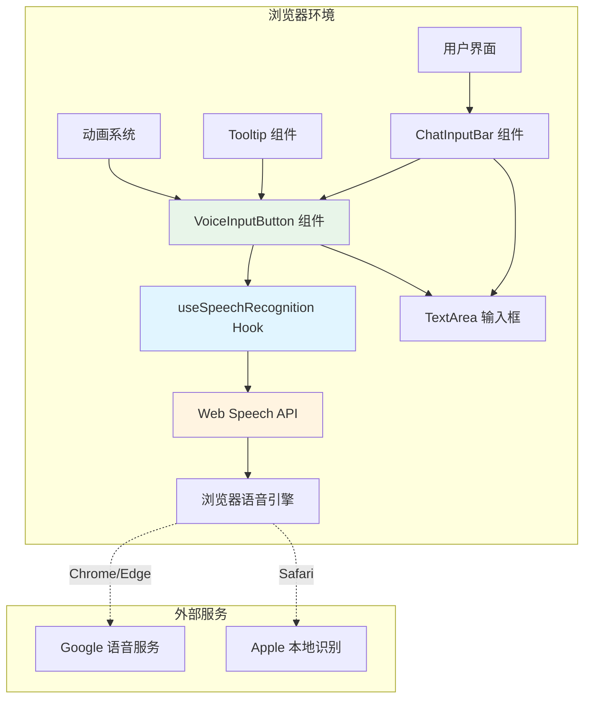
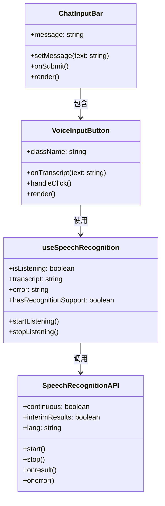
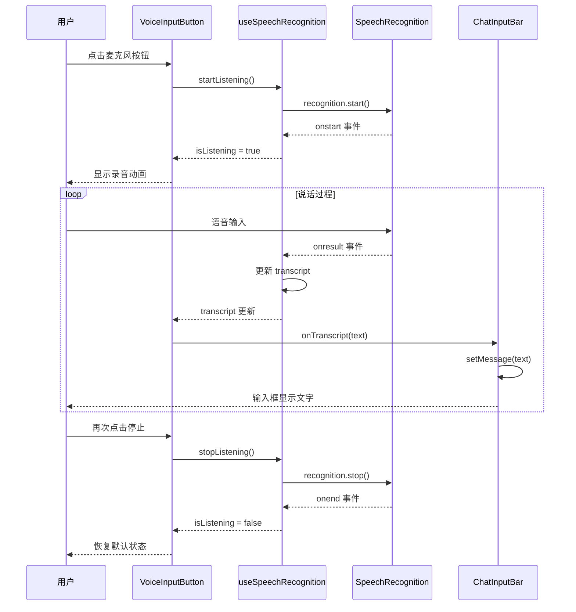
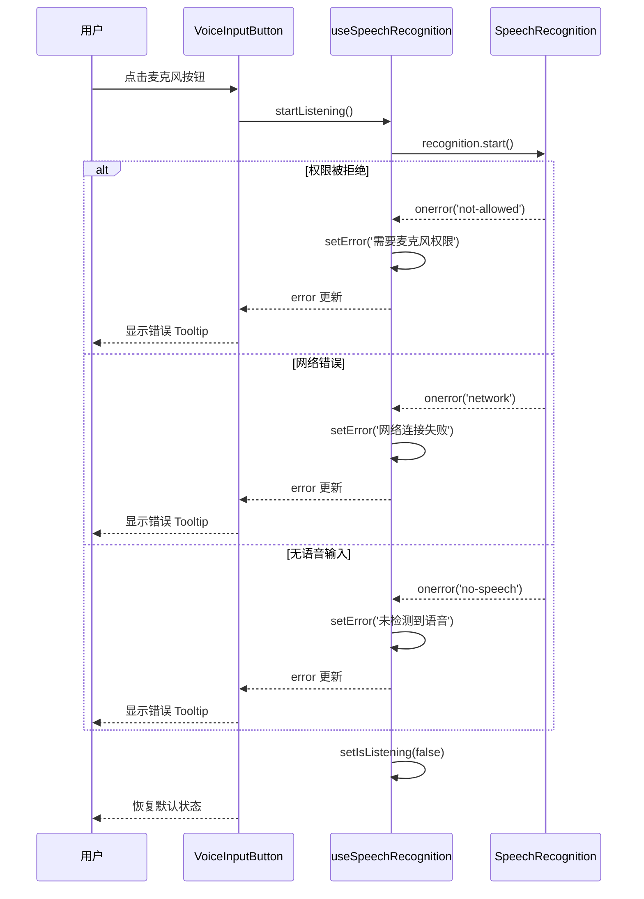
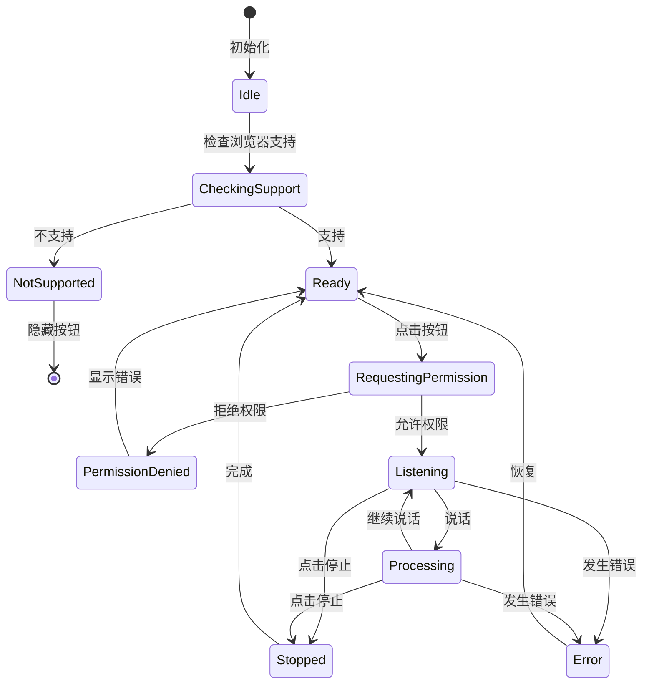

# 语音输入功能架构方案

## 文档信息

- **项目名称**: Onyx KM 知识管理系统
- **功能模块**: 聊天界面语音输入
- **文档版本**: v1.0
- **创建日期**: 2025-11-26
- **作者**: AI Assistant

---

## 1. 架构概述

### 1.1 系统定位

语音输入功能是 Onyx 聊天界面的增强模块,采用**纯前端实现**方案,利用浏览器原生 Web Speech API 提供语音转文字能力,无需后端支持。

### 1.2 架构原则

- **低耦合**: 独立组件,不影响现有聊天功能
- **高内聚**: 语音识别逻辑封装在专用 Hook 中
- **可扩展**: 预留接口,支持未来集成其他语音服务
- **渐进增强**: 不支持的浏览器自动降级
- **零依赖**: 不引入额外的 npm 包

### 1.3 技术栈

| 层级 | 技术 | 版本 | 说明 |
|------|------|------|------|
| 前端框架 | React | 18.x | 现有技术栈 |
| 语言 | TypeScript | 5.x | 类型安全 |
| 样式 | Tailwind CSS | 3.x | 现有技术栈 |
| 图标 | react-icons | 4.8.0 | 现有依赖 |
| 语音识别 | Web Speech API | - | 浏览器原生 |

---

## 2. 系统架构

### 2.1 整体架构图



### 2.2 分层架构

```
┌─────────────────────────────────────────────────┐
│              表现层 (Presentation)               │
│  ┌──────────────────────────────────────────┐  │
│  │  VoiceInputButton Component              │  │
│  │  - UI 渲染                                │  │
│  │  - 用户交互                               │  │
│  │  - 视觉反馈                               │  │
│  └──────────────────────────────────────────┘  │
└─────────────────────────────────────────────────┘
                      ↓
┌─────────────────────────────────────────────────┐
│              业务逻辑层 (Business Logic)         │
│  ┌──────────────────────────────────────────┐  │
│  │  useSpeechRecognition Hook               │  │
│  │  - 状态管理                               │  │
│  │  - 事件处理                               │  │
│  │  - 错误处理                               │  │
│  └──────────────────────────────────────────┘  │
└─────────────────────────────────────────────────┘
                      ↓
┌─────────────────────────────────────────────────┐
│              数据访问层 (Data Access)            │
│  ┌──────────────────────────────────────────┐  │
│  │  Web Speech API                          │  │
│  │  - SpeechRecognition 接口                │  │
│  │  - 浏览器原生能力                         │  │
│  └──────────────────────────────────────────┘  │
└─────────────────────────────────────────────────┘
```

---

## 3. 核心组件设计

### 3.1 组件关系图



### 3.2 组件职责

#### 3.2.1 ChatInputBar (父组件)

**职责**:
- 管理输入框内容状态
- 协调各个输入方式(键盘、语音、文件)
- 处理消息发送逻辑

**接口**:
```typescript
interface ChatInputBarProps {
  message: string;
  setMessage: (message: string) => void;
  onSubmit: () => void;
  // ... 其他现有 props
}
```

**修改点**:
- 添加 `VoiceInputButton` 组件
- 处理语音识别结果的回调

#### 3.2.2 VoiceInputButton (新增组件)

**职责**:
- 渲染麦克风按钮
- 处理用户点击事件
- 显示录音状态动画
- 提供 Tooltip 提示

**接口**:
```typescript
interface VoiceInputButtonProps {
  onTranscript: (text: string) => void;  // 识别结果回调
  className?: string;                     // 自定义样式
}
```

**状态**:
```typescript
{
  // 从 Hook 获取
  isListening: boolean;
  transcript: string;
  error: string | null;
}
```

#### 3.2.3 useSpeechRecognition (新增 Hook)

**职责**:
- 封装 Web Speech API 调用逻辑
- 管理语音识别状态
- 处理识别结果和错误
- 提供统一的接口

**接口**:
```typescript
interface UseSpeechRecognitionReturn {
  isListening: boolean;              // 是否正在录音
  transcript: string;                // 识别结果
  startListening: () => void;        // 开始录音
  stopListening: () => void;         // 停止录音
  hasRecognitionSupport: boolean;    // 浏览器是否支持
  error: string | null;              // 错误信息
}
```

**内部状态**:
```typescript
{
  recognitionRef: React.RefObject<SpeechRecognition>;  // API 实例引用
  isListening: boolean;
  transcript: string;
  error: string | null;
}
```

---

## 4. 数据流设计

### 4.1 正常流程



### 4.2 错误处理流程



### 4.3 状态转换图



---

## 5. 接口设计

### 5.1 组件接口

#### VoiceInputButton Props

```typescript
interface VoiceInputButtonProps {
  /**
   * 识别结果回调函数
   * @param text - 识别到的文字
   */
  onTranscript: (text: string) => void;
  
  /**
   * 自定义 CSS 类名
   * @default ''
   */
  className?: string;
}
```

#### useSpeechRecognition Hook

```typescript
/**
 * 语音识别 Hook
 * @returns 语音识别状态和控制方法
 */
function useSpeechRecognition(): UseSpeechRecognitionReturn;

interface UseSpeechRecognitionReturn {
  /** 是否正在录音 */
  isListening: boolean;
  
  /** 识别结果文本 */
  transcript: string;
  
  /** 开始录音 */
  startListening: () => void;
  
  /** 停止录音 */
  stopListening: () => void;
  
  /** 浏览器是否支持语音识别 */
  hasRecognitionSupport: boolean;
  
  /** 错误信息,无错误时为 null */
  error: string | null;
}
```

### 5.2 Web Speech API 接口

```typescript
interface SpeechRecognition extends EventTarget {
  // 配置属性
  continuous: boolean;        // 是否持续识别
  interimResults: boolean;    // 是否返回临时结果
  lang: string;               // 识别语言
  maxAlternatives: number;    // 最多返回结果数
  
  // 控制方法
  start(): void;              // 开始识别
  stop(): void;               // 停止识别
  abort(): void;              // 中止识别
  
  // 事件处理器
  onstart: (event: Event) => void;
  onend: (event: Event) => void;
  onresult: (event: SpeechRecognitionEvent) => void;
  onerror: (event: SpeechRecognitionErrorEvent) => void;
  // ... 其他事件
}
```

### 5.3 事件接口

```typescript
interface SpeechRecognitionEvent extends Event {
  readonly resultIndex: number;
  readonly results: SpeechRecognitionResultList;
}

interface SpeechRecognitionResultList {
  readonly length: number;
  item(index: number): SpeechRecognitionResult;
  [index: number]: SpeechRecognitionResult;
}

interface SpeechRecognitionResult {
  readonly length: number;
  readonly isFinal: boolean;
  item(index: number): SpeechRecognitionAlternative;
  [index: number]: SpeechRecognitionAlternative;
}

interface SpeechRecognitionAlternative {
  readonly transcript: string;
  readonly confidence: number;
}

interface SpeechRecognitionErrorEvent extends Event {
  readonly error: string;
  readonly message: string;
}
```

---

## 6. 文件结构

### 6.1 新增文件

```
web/
├── src/
│   ├── app/
│   │   └── chat/
│   │       └── input/
│   │           ├── ChatInputBar.tsx          # 修改:集成语音按钮
│   │           └── VoiceInputButton.tsx      # 新增:语音输入按钮组件
│   ├── hooks/
│   │   └── useSpeechRecognition.ts           # 新增:语音识别 Hook
│   └── types/
│       └── speech-recognition.d.ts           # 新增:类型声明文件
└── docs/
    ├── 语音输入功能设计方案.md                # 新增:设计文档
    └── 语音输入功能架构方案.md                # 新增:架构文档
```

### 6.2 文件依赖关系

```mermaid
graph LR
    A[ChatInputBar.tsx] --> B[VoiceInputButton.tsx]
    B --> C[useSpeechRecognition.ts]
    C --> D[speech-recognition.d.ts]
    B --> E[react-icons/fi]
    B --> F[@/components/ui/tooltip]
```

---

## 7. 配置管理

### 7.1 语音识别配置

```typescript
// useSpeechRecognition.ts 中的配置
const SPEECH_RECOGNITION_CONFIG = {
  // 识别语言
  lang: 'zh-CN',              // 默认中文
  
  // 是否持续识别
  continuous: true,           // 持续录音直到手动停止
  
  // 是否返回临时结果
  interimResults: true,       // 实时显示识别中的文字
  
  // 最多返回结果数
  maxAlternatives: 1,         // 只返回最可能的结果
  
  // 自动停止时间(毫秒)
  autoStopTimeout: 60000,     // 60秒后自动停止
};
```

### 7.2 UI 配置

```typescript
// VoiceInputButton.tsx 中的配置
const UI_CONFIG = {
  // 按钮尺寸
  buttonSize: {
    width: 32,
    height: 32,
  },
  
  // 图标尺寸
  iconSize: 18,
  
  // 动画配置
  animation: {
    pulse: 'animate-pulse',
    ping: 'animate-ping',
    transition: 'transition-all duration-200',
  },
  
  // 颜色配置
  colors: {
    default: 'text-gray-600 dark:text-gray-400',
    hover: 'hover:bg-gray-100 dark:hover:bg-gray-800',
    recording: 'bg-red-500 text-white',
    error: 'bg-orange-500 text-white',
  },
};
```

### 7.3 错误消息配置

```typescript
const ERROR_MESSAGES: Record<string, string> = {
  'not-allowed': '需要麦克风权限才能使用语音输入',
  'no-speech': '未检测到语音输入,请重试',
  'audio-capture': '无法访问麦克风,请检查设备',
  'network': '网络连接失败,请检查网络',
  'not-supported': '您的浏览器不支持语音输入功能',
  'aborted': '语音识别已中止',
  'service-not-allowed': '语音识别服务不可用',
};
```

---

## 8. 性能优化

### 8.1 组件优化

#### 8.1.1 React.memo

```typescript
export const VoiceInputButton = React.memo<VoiceInputButtonProps>(
  ({ onTranscript, className }) => {
    // 组件实现
  },
  (prevProps, nextProps) => {
    // 自定义比较函数
    return prevProps.className === nextProps.className;
  }
);
```

#### 8.1.2 useCallback

```typescript
const handleClick = useCallback(() => {
  if (isListening) {
    stopListening();
  } else {
    startListening();
  }
}, [isListening, startListening, stopListening]);
```

#### 8.1.3 useEffect 依赖优化

```typescript
useEffect(() => {
  if (transcript) {
    onTranscript(transcript);
  }
}, [transcript]); // 只依赖 transcript,不依赖 onTranscript
```

### 8.2 资源管理

#### 8.2.1 清理副作用

```typescript
useEffect(() => {
  const recognition = recognitionRef.current;
  
  return () => {
    // 组件卸载时停止识别
    if (recognition && isListening) {
      recognition.stop();
    }
  };
}, [isListening]);
```

#### 8.2.2 防抖处理

```typescript
// 防止快速点击
const [isProcessing, setIsProcessing] = useState(false);

const handleClick = async () => {
  if (isProcessing) return;
  
  setIsProcessing(true);
  try {
    // 执行操作
  } finally {
    setTimeout(() => setIsProcessing(false), 300);
  }
};
```

### 8.3 性能监控

```typescript
// 开发环境性能监控
if (process.env.NODE_ENV === 'development') {
  const startTime = performance.now();
  
  recognition.onstart = () => {
    const latency = performance.now() - startTime;
    console.log(`[Performance] 录音启动延迟: ${latency}ms`);
  };
}
```

---

## 9. 安全设计

### 9.1 权限控制

```typescript
// 权限状态检查
async function checkMicrophonePermission(): Promise<PermissionState> {
  if (!navigator.permissions) {
    return 'prompt';
  }
  
  try {
    const result = await navigator.permissions.query({ 
      name: 'microphone' as PermissionName 
    });
    return result.state;
  } catch (error) {
    return 'prompt';
  }
}
```

### 9.2 输入验证

```typescript
// 对识别结果进行清理
function sanitizeTranscript(text: string): string {
  // 移除潜在的 XSS 攻击代码
  return text
    .replace(/<script[^>]*>.*?<\/script>/gi, '')
    .replace(/<[^>]+>/g, '')
    .trim();
}
```

### 9.3 错误边界

```typescript
class VoiceInputErrorBoundary extends React.Component {
  componentDidCatch(error: Error, errorInfo: React.ErrorInfo) {
    // 记录错误
    console.error('VoiceInput Error:', error, errorInfo);
    
    // 上报错误(可选)
    // reportError(error);
  }
  
  render() {
    return this.props.children;
  }
}
```

---

## 10. 测试策略

### 10.1 单元测试

```typescript
// useSpeechRecognition.test.ts
describe('useSpeechRecognition', () => {
  it('should start listening when startListening is called', () => {
    const { result } = renderHook(() => useSpeechRecognition());
    
    act(() => {
      result.current.startListening();
    });
    
    expect(result.current.isListening).toBe(true);
  });
  
  it('should update transcript when speech is recognized', () => {
    const { result } = renderHook(() => useSpeechRecognition());
    
    // 模拟语音识别结果
    act(() => {
      // 触发 onresult 事件
    });
    
    expect(result.current.transcript).toBe('expected text');
  });
});
```

### 10.2 集成测试

```typescript
// VoiceInputButton.test.tsx
describe('VoiceInputButton', () => {
  it('should call onTranscript when speech is recognized', () => {
    const onTranscript = jest.fn();
    render(<VoiceInputButton onTranscript={onTranscript} />);
    
    // 模拟点击按钮
    fireEvent.click(screen.getByRole('button'));
    
    // 模拟语音识别
    // ...
    
    expect(onTranscript).toHaveBeenCalledWith('expected text');
  });
});
```

### 10.3 E2E 测试

```typescript
// voice-input.spec.ts
test('should input text via voice', async ({ page }) => {
  await page.goto('http://localhost:3000/chat');
  
  // 点击麦克风按钮
  await page.click('[aria-label="开始语音输入"]');
  
  // 等待录音状态
  await page.waitForSelector('[aria-label="停止录音"]');
  
  // 模拟语音输入(需要特殊工具)
  // ...
  
  // 验证输入框内容
  const inputValue = await page.inputValue('textarea');
  expect(inputValue).toContain('expected text');
});
```

---

## 11. 部署方案

### 11.1 开发环境

```bash
# 1. 创建新文件
cd web
mkdir -p src/hooks src/types
touch src/hooks/useSpeechRecognition.ts
touch src/app/chat/input/VoiceInputButton.tsx
touch src/types/speech-recognition.d.ts

# 2. 启动开发服务器
npm run dev

# 3. 访问测试
open http://localhost:3000/chat
```

### 11.2 生产环境

```bash
# 1. 构建生产版本
cd web
npm run build

# 2. 重启 Docker 容器
cd ../../deployment/docker_compose
docker compose -f docker-compose.km.yml -p km restart web_server

# 3. 验证部署
curl http://localhost:3000
```

### 11.3 灰度发布

```typescript
// 使用特性开关控制功能上线
const FEATURE_FLAGS = {
  voiceInput: {
    enabled: process.env.NEXT_PUBLIC_VOICE_INPUT_ENABLED === 'true',
    rolloutPercentage: 10, // 10% 用户
  },
};

// 在组件中使用
if (!FEATURE_FLAGS.voiceInput.enabled) {
  return null;
}
```

---

## 12. 监控与运维

### 12.1 性能监控

```typescript
// 性能指标收集
const performanceMetrics = {
  startLatency: 0,        // 启动延迟
  recognitionLatency: 0,  // 识别延迟
  errorRate: 0,           // 错误率
  usageCount: 0,          // 使用次数
};

// 上报性能数据
function reportMetrics(metrics: typeof performanceMetrics) {
  // 发送到监控服务
  fetch('/api/metrics', {
    method: 'POST',
    body: JSON.stringify(metrics),
  });
}
```

### 12.2 错误监控

```typescript
// 错误追踪
recognition.onerror = (event) => {
  // 记录错误
  console.error('Speech recognition error:', event.error);
  
  // 上报错误
  reportError({
    type: 'speech_recognition_error',
    error: event.error,
    message: event.message,
    timestamp: new Date().toISOString(),
  });
};
```

### 12.3 用户行为分析

```typescript
// 行为追踪
const trackEvent = (eventName: string, properties?: object) => {
  // 发送到分析服务
  analytics.track(eventName, {
    ...properties,
    timestamp: new Date().toISOString(),
  });
};

// 使用示例
trackEvent('voice_input_started');
trackEvent('voice_input_completed', { 
  duration: 5000,
  wordCount: 20,
});
```

---

## 13. 扩展性设计

### 13.1 插件化架构

```typescript
// 语音识别提供商接口
interface SpeechRecognitionProvider {
  start(): Promise<void>;
  stop(): Promise<void>;
  onResult(callback: (text: string) => void): void;
  onError(callback: (error: Error) => void): void;
}

// Web Speech API 实现
class WebSpeechProvider implements SpeechRecognitionProvider {
  // 实现接口
}

// DeepSeek Whisper 实现
class WhisperProvider implements SpeechRecognitionProvider {
  // 实现接口
}

// 提供商工厂
function createProvider(type: 'web' | 'whisper'): SpeechRecognitionProvider {
  switch (type) {
    case 'web':
      return new WebSpeechProvider();
    case 'whisper':
      return new WhisperProvider();
  }
}
```

### 13.2 配置化

```typescript
// 配置文件
const voiceInputConfig = {
  provider: 'web',              // 'web' | 'whisper' | 'custom'
  language: 'zh-CN',            // 默认语言
  autoStop: true,               // 自动停止
  autoStopDelay: 3000,          // 自动停止延迟(毫秒)
  showInterimResults: true,     // 显示临时结果
  enableCommands: false,        // 启用语音命令
  commands: {                   // 语音命令配置
    send: ['发送', 'send'],
    clear: ['清空', 'clear'],
  },
};
```

### 13.3 国际化支持

```typescript
// 多语言配置
const i18n = {
  'zh-CN': {
    startRecording: '开始语音输入',
    stopRecording: '停止录音',
    permissionDenied: '需要麦克风权限',
    notSupported: '浏览器不支持语音输入',
  },
  'en-US': {
    startRecording: 'Start voice input',
    stopRecording: 'Stop recording',
    permissionDenied: 'Microphone permission required',
    notSupported: 'Voice input not supported',
  },
};
```

---

## 14. 附录

### 14.1 技术参考

- [Web Speech API 规范](https://wicg.github.io/speech-api/)
- [MDN Web Speech API](https://developer.mozilla.org/en-US/docs/Web/API/Web_Speech_API)
- [Can I Use - Speech Recognition](https://caniuse.com/speech-recognition)
- [React Hooks 最佳实践](https://react.dev/reference/react)

### 14.2 相关文档

- 设计方案: `docs/语音输入功能设计方案.md`
- 实施计划: `implementation_plan.md`
- 任务清单: `task.md`

### 14.3 版本历史

| 版本 | 日期 | 作者 | 变更说明 |
|------|------|------|----------|
| v1.0 | 2025-11-26 | AI Assistant | 初始版本 |

---

**文档结束**
