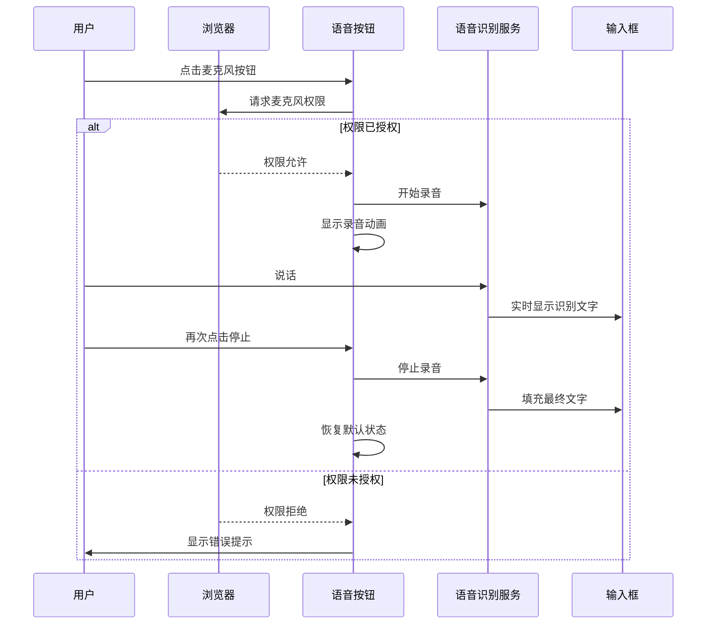
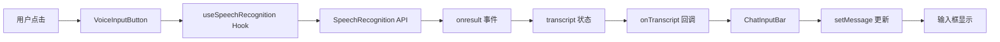
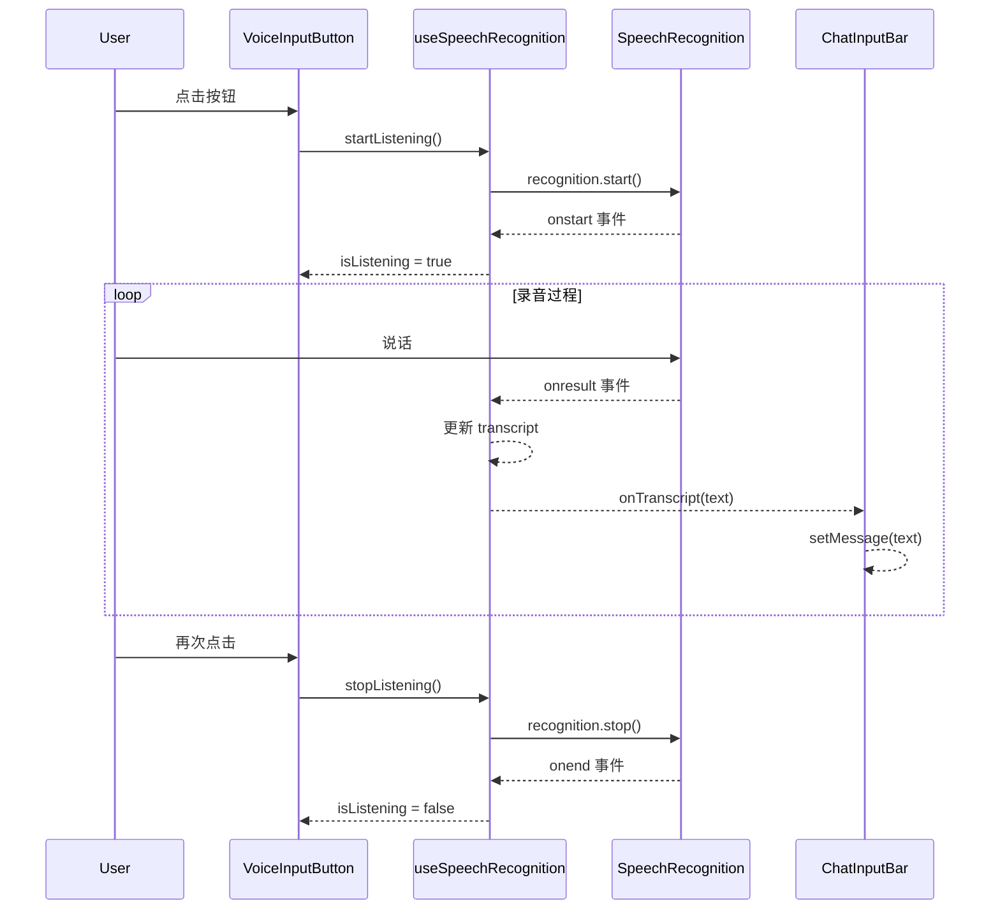

# 语音输入功能设计方案

## 文档信息

- **项目名称**: Onyx KM 知识管理系统
- **功能模块**: 聊天界面语音输入
- **文档版本**: v1.0
- **创建日期**: 2025-11-26
- **作者**: AI Assistant

---

## 1. 需求背景

### 1.1 业务需求

在当前的 Onyx 聊天界面中,用户只能通过键盘输入文字与 AI 助手进行交互。为了提升用户体验,特别是在以下场景:

- 📱 移动设备使用场景
- 🚗 驾驶或移动中无法打字
- 👴 老年用户或打字不便的用户
- 🌍 多语言输入需求

需要添加语音输入功能,让用户可以通过语音快速输入问题。

### 1.2 用户价值

- **提升效率**: 语音输入速度通常快于打字
- **降低门槛**: 降低使用难度,扩大用户群体
- **增强体验**: 提供更自然的交互方式
- **多场景支持**: 适应更多使用场景

### 1.3 功能目标

- ✅ 用户可以通过点击麦克风按钮开始语音输入
- ✅ 实时将语音转换为文字并显示在输入框
- ✅ 支持中文和英文等多语言识别
- ✅ 提供清晰的视觉反馈(录音状态指示)
- ✅ 处理权限请求和错误情况

---

## 2. 功能设计

### 2.1 功能范围

#### 核心功能

| 功能项 | 描述 | 优先级 |
|--------|------|--------|
| 语音录制 | 点击麦克风按钮开始/停止录音 | P0 |
| 实时转写 | 将语音实时转换为文字 | P0 |
| 文字填充 | 自动填充识别结果到输入框 | P0 |
| 状态反馈 | 录音中的视觉动画提示 | P0 |
| 权限处理 | 请求和处理麦克风权限 | P0 |

#### 扩展功能(未来版本)

| 功能项 | 描述 | 优先级 |
|--------|------|--------|
| 语言切换 | 支持多语言识别切换 | P1 |
| 语音命令 | 支持"发送"、"清空"等语音指令 | P2 |
| 离线识别 | 本地语音识别模型 | P2 |
| 识别历史 | 保存语音识别历史记录 | P3 |

### 2.2 用户交互流程



### 2.3 界面设计

#### 2.3.1 布局位置

语音输入按钮位于聊天输入框底部工具栏,发送按钮左侧:

```
┌─────────────────────────────────────────────────────────┐
│  Message deepseek-chat assistant...                     │
│  ┌───────────────────────────────────────────────────┐  │
│  │                                                    │  │
│  │  [用户输入的文字内容]                               │  │
│  │                                                    │  │
│  └───────────────────────────────────────────────────┘  │
│                                                          │
│  ┌────────────────────────────────────────────────────┐ │
│  │ [📎] [🤖] [🔍]                    [🎙️] [●]         │ │
│  │  文件  模型  过滤器                语音  发送        │ │
│  └────────────────────────────────────────────────────┘ │
└─────────────────────────────────────────────────────────┘
```

#### 2.3.2 视觉状态

| 状态 | 图标 | 颜色 | 动画效果 | 说明 |
|------|------|------|----------|------|
| 默认 | 🎙️ | 灰色 | 无 | 未录音状态 |
| 悬停 | 🎙️ | 深灰 | 背景高亮 | 鼠标悬停 |
| 录音中 | 🎙️ | 红色 | 脉冲动画 + 红点闪烁 | 正在录音 |
| 识别中 | ⏳ | 蓝色 | 旋转动画 | 处理中 |
| 错误 | ⚠️ | 橙色 | 无 | 发生错误 |

#### 2.3.3 UI 规范

**按钮尺寸**:
- 宽度: 32px
- 高度: 32px
- 圆角: 50% (圆形)

**颜色规范**:
- 默认: `text-gray-600 dark:text-gray-400`
- 悬停: `hover:bg-gray-100 dark:hover:bg-gray-800`
- 录音中: `bg-red-500 text-white`
- 错误: `bg-orange-500 text-white`

**动画效果**:
- 脉冲动画: `animate-pulse` (Tailwind CSS)
- 红点闪烁: `animate-ping` (Tailwind CSS)
- 过渡时间: `transition-all duration-200`

### 2.4 交互细节

#### 2.4.1 权限请求

**首次使用流程**:
1. 用户点击麦克风按钮
2. 浏览器弹出权限请求对话框
3. 用户选择"允许"或"拒绝"
4. 根据用户选择执行相应操作

**权限被拒绝处理**:
- 显示 Tooltip 提示:"需要麦克风权限才能使用语音输入"
- 提供指引链接,说明如何在浏览器设置中开启权限

#### 2.4.2 录音控制

**开始录音**:
- 点击麦克风按钮
- 按钮变为红色并开始脉冲动画
- 右上角显示红色闪烁指示点
- Tooltip 文字变为"点击停止录音"

**停止录音**:
- 再次点击麦克风按钮
- 或自动停止(静音超过 3 秒)
- 按钮恢复默认状态
- 识别结果填充到输入框

#### 2.4.3 文字填充策略

**实时显示**:
- 在录音过程中,临时识别结果实时显示在输入框
- 使用浅色文字表示临时结果

**最终确认**:
- 停止录音后,最终识别结果替换临时文字
- 使用正常文字颜色
- 光标自动定位到文字末尾

**追加模式**:
- 如果输入框已有内容,识别结果追加到末尾
- 自动添加空格分隔

#### 2.4.4 错误处理

| 错误类型 | 提示信息 | 处理方式 |
|----------|----------|----------|
| 权限拒绝 | "需要麦克风权限才能使用语音输入" | 显示设置指引 |
| 浏览器不支持 | "您的浏览器不支持语音输入功能" | 隐藏按钮 |
| 网络错误 | "网络连接失败,请检查网络" | 允许重试 |
| 识别失败 | "未能识别到语音,请重试" | 清空输入,允许重试 |
| 麦克风占用 | "麦克风被其他应用占用" | 提示关闭其他应用 |

---

## 3. 技术方案

### 3.1 技术选型

#### 方案对比

| 方案 | 技术栈 | 优点 | 缺点 | 成本 | 推荐度 |
|------|--------|------|------|------|--------|
| Web Speech API | 浏览器原生 | 免费、实时、无需后端 | 浏览器兼容性有限 | 免费 | ⭐⭐⭐⭐⭐ |
| DeepSeek Whisper | API 调用 | 准确率高、稳定 | 需要网络、有成本 | 按量付费 | ⭐⭐⭐ |
| 本地 Whisper | 本地模型 | 隐私性好、离线可用 | 需要部署、资源消耗大 | 服务器成本 | ⭐⭐ |
| 百度/讯飞语音 | 第三方 API | 中文识别好 | 依赖第三方、有成本 | 按量付费 | ⭐⭐⭐ |

#### 最终选择

**采用 Web Speech API** 作为主要实现方案,理由如下:

✅ **零成本**: 浏览器原生支持,无需 API 调用费用  
✅ **实时性**: 边说边转写,用户体验好  
✅ **易实现**: 前端即可完成,无需后端改动  
✅ **维护简单**: 无需管理 API 密钥和配额  
✅ **隐私保护**: 语音数据不离开浏览器(Chrome 除外)

⚠️ **注意事项**:
- Chrome/Edge 支持最好
- Safari/Firefox 部分支持
- 需要 HTTPS 环境(localhost 除外)

### 3.2 浏览器兼容性

| 浏览器 | 版本要求 | 支持程度 | 备注 |
|--------|----------|----------|------|
| Chrome | 25+ | ✅ 完全支持 | 推荐使用 |
| Edge | 79+ | ✅ 完全支持 | 基于 Chromium |
| Safari | 14.1+ | ⚠️ 部分支持 | 需要用户手动启用 |
| Firefox | 未支持 | ❌ 不支持 | 可能未来支持 |
| Opera | 27+ | ✅ 完全支持 | 基于 Chromium |
| IE | - | ❌ 不支持 | 已停止支持 |

**兼容性处理策略**:
- 不支持的浏览器自动隐藏语音按钮
- 提供降级方案(继续使用键盘输入)
- 在设置中提示推荐使用的浏览器

### 3.3 性能指标

| 指标 | 目标值 | 测量方法 |
|------|--------|----------|
| 录音启动延迟 | < 500ms | 点击到开始录音的时间 |
| 识别延迟 | < 1s | 说话到显示文字的时间 |
| 内存占用 | < 50MB | Chrome DevTools 监控 |
| CPU 占用 | < 10% | 录音期间 CPU 使用率 |
| 识别准确率 | > 90% | 中文普通话测试 |

---

## 4. 数据流设计

### 4.1 组件数据流



### 4.2 状态管理

**组件内部状态**:
```typescript
{
  isListening: boolean;      // 是否正在录音
  transcript: string;        // 识别结果文本
  error: string | null;      // 错误信息
  hasRecognitionSupport: boolean; // 浏览器是否支持
}
```

**父组件状态**:
```typescript
{
  message: string;  // 输入框内容(包含语音识别结果)
}
```

### 4.3 事件流



---

## 5. 安全与隐私

### 5.1 权限控制

- 遵循浏览器权限模型,需要用户明确授权
- 不在后台偷偷录音
- 录音状态有明确的视觉指示

### 5.2 数据隐私

**Web Speech API 隐私说明**:
- Chrome: 语音数据会发送到 Google 服务器进行识别
- Safari: 使用设备本地识别(iOS 13+)
- 建议在隐私政策中说明

**隐私保护措施**:
- 不保存语音录音文件
- 识别结果仅保存在前端内存
- 用户可随时清空输入内容

### 5.3 安全要求

- 仅在 HTTPS 环境下可用(localhost 除外)
- 防止 XSS 攻击(对识别结果进行转义)
- 限制单次录音时长(最长 60 秒)

---

## 6. 用户体验优化

### 6.1 反馈机制

**视觉反馈**:
- 录音中: 红色脉冲动画 + 闪烁红点
- 识别中: 输入框显示临时文字(浅色)
- 完成: 文字变为正常颜色

**听觉反馈**(可选):
- 开始录音: "嘀"提示音
- 停止录音: "嘀嘀"提示音

**触觉反馈**(移动端):
- 点击按钮时震动反馈

### 6.2 错误提示

**友好的错误信息**:
- ❌ 不好: "Error: not-allowed"
- ✅ 好: "需要麦克风权限才能使用语音输入,请在浏览器设置中允许"

**错误恢复指引**:
- 提供具体的解决步骤
- 附带设置截图或链接
- 允许用户重试

### 6.3 无障碍支持

- 按钮添加 `aria-label` 属性
- 支持键盘快捷键(如 Ctrl+M 开始录音)
- 提供屏幕阅读器友好的状态提示

---

## 7. 测试计划

### 7.1 功能测试

| 测试项 | 测试场景 | 预期结果 |
|--------|----------|----------|
| 基础录音 | 点击按钮开始录音 | 按钮变红,开始录音 |
| 停止录音 | 再次点击按钮 | 停止录音,文字填充 |
| 实时识别 | 录音过程中说话 | 实时显示识别文字 |
| 追加模式 | 输入框有内容时录音 | 新文字追加到末尾 |
| 权限请求 | 首次使用 | 弹出权限请求 |
| 权限拒绝 | 拒绝权限 | 显示错误提示 |
| 多语言 | 说中文和英文 | 正确识别两种语言 |

### 7.2 兼容性测试

- Chrome 最新版 ✅
- Edge 最新版 ✅
- Safari 14.1+ ⚠️
- Firefox ❌(不支持)
- 移动端 Chrome ✅
- 移动端 Safari ⚠️

### 7.3 性能测试

- 连续录音 10 次,检查内存泄漏
- 长时间录音(60 秒),检查稳定性
- 快速点击按钮,检查状态管理
- 网络断开时的表现

### 7.4 用户测试

- 邀请 10 名用户进行真实场景测试
- 收集用户反馈和改进建议
- 统计识别准确率和用户满意度

---

## 8. 上线计划

### 8.1 发布策略

**灰度发布**:
1. 第一阶段: 10% 用户(1 周)
2. 第二阶段: 50% 用户(1 周)
3. 第三阶段: 100% 用户

**回滚方案**:
- 通过配置开关快速关闭功能
- 保留原有键盘输入方式

### 8.2 监控指标

| 指标 | 目标 | 监控方式 |
|------|------|----------|
| 功能使用率 | > 20% | 统计点击次数 |
| 识别成功率 | > 90% | 统计错误次数 |
| 用户满意度 | > 4.0/5.0 | 用户反馈评分 |
| 错误率 | < 5% | 错误日志统计 |

### 8.3 文档准备

- ✅ 用户使用指南
- ✅ 常见问题 FAQ
- ✅ 开发文档
- ✅ API 文档

---

## 9. 未来规划

### 9.1 功能增强

**短期(1-3 个月)**:
- 支持语言切换(中文/英文/日文等)
- 添加语音命令("发送"、"清空"等)
- 优化识别准确率

**中期(3-6 个月)**:
- 集成 DeepSeek Whisper API 作为备选方案
- 支持离线识别(PWA)
- 添加语音识别历史记录

**长期(6-12 个月)**:
- 支持方言识别
- 语音情感分析
- 多人对话识别

### 9.2 技术优化

- 使用 WebAssembly 提升性能
- 实现本地 Whisper 模型
- 支持更多浏览器

---

## 10. 附录

### 10.1 参考资料

- [Web Speech API 文档](https://developer.mozilla.org/en-US/docs/Web/API/Web_Speech_API)
- [SpeechRecognition 接口](https://developer.mozilla.org/en-US/docs/Web/API/SpeechRecognition)
- [浏览器兼容性](https://caniuse.com/speech-recognition)

### 10.2 相关链接

- 技术架构方案: `docs/语音输入功能架构方案.md`
- 实施计划: `implementation_plan.md`
- 任务清单: `task.md`

---

**文档结束**
